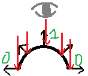
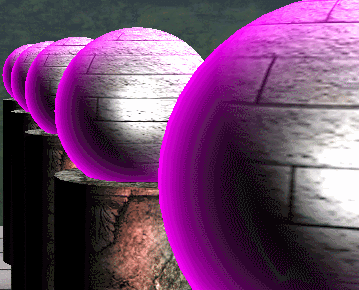

# Emissive Light
Emissive 는 외곽선을 표현해주는 빛이다.



구하는 방법은 보고 있는 방향의 벡터와 각 픽셀이 앞으로 향하고 있는 벡터를 외적하게 되면 직교하면 할수록 0에 가깝게 나온다. 이 값을 반대로 바꾸면 1로 표현 된다.

여기에 emissive의 색을 곱해주면 값이 나온다.

## Shader
```
[flatten]
if(Material.Emissive.a > 0.0f)
{
    float NdotE = dot(E, normalize(normal));
    float emissive = smoothstep(1.0f - Material.Emissive, 1.0f, 1.0f - saturate(NdotE));
        
    output.Emissive = Material.Emissive * emissive;
}
```
00_Light.fx 의 ComputeLight 함수에 이 명령어를 추가시킨다. 위에서 말한 공식이다.

## LightingDemo
각 오브젝트에 EmissiveLight에 값을 추가시켜 준다.

여기서는 (0.15,0.15,0.15,0.3)으로 아주 약하게 줬다.


잘 들어갔는지 확인하고 싶기 때문에 Emissive를 변경해주면




이것으로 여러가지 연출을 줄 수 있을 것 같다.