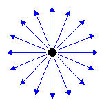

# Point Light


이런 식으로 전구에 불을 키면 사방에 빛이 퍼지는것 처럼 퍼진다.

## Shader
00_Light.fx
```
void ComputePointLight(inout MaterialDesc output, float3 normal, float3 wPosition)
{
    output = MakeMaterial();
    MaterialDesc result = MakeMaterial();
    
    // Light 갯수만큼 for문을 돌아준다.(현재 최대 256개)
    // [unroll(MAX_POINT_LIGHTS)] -> 실행속도는 빨라지지만, 컴파일 속도는 느려진다.
    for (uint i = 0; i < PointLightCount; i++)
    {
        // wPosition : 레스터라이징이 되어 있는 정점의 위치
        // PointLight의 위치에서 정점 위치까지의 거리를 구하기
        float3 light = PointLights[i].Position - wPosition;
        float dist = length(light);
        
        // 거리거 PointLight의 범위를 넘어선다면 제외
        [flatten]
        if (dist > PointLights[i].Range)
        { continue; }
        
        light /= dist; // Normalize
        
        // Ambient는 자신이 갖고있는 Ambient와 빛의 Ambient를 곱해주면 된다.
        result.Ambient = PointLights[i].Ambient * Material.Ambient;
        
        // 이미 전역광에 대한 음영을 계산했지만, PointLight빛에 의해
        // 음영은 진해지기도 학도 빛에 의해 어두워 지는 부분 땜누에 PointLight에 대한 음영을 계산해준다. (빛은 누적됨)
        float NdotL = dot(light, normalize(normal));
        float3 E = normalize(ViewPosition() - wPosition); // 카메라가 바라보는 벡터
    
        // 조명각이 벗어났나 확인
        [flatten]
        if (NdotL > 0.0f)
        {
            result.Diffuse = Material.Diffuse * NdotL * PointLights[i].Diffuse;
        
        // 강도가 0 이하라면 연산 할 필요가 없기 때문
            [flatten]
            if (Material.Specular.a > 0.0f)
            {
            // 반사식 중요
                // 전역광이 아닌 Light에 대한 반사 계산 (Specular 계산)
                float3 R = normalize(reflect(-light, normal));
                float RdotE = saturate(dot(R, E));

                float specular = pow(RdotE, Material.Specular.a);
                result.Specular = Material.Specular * specular * PointLights[i].Specular;
            }
        }
    
        [flatten]
        if (Material.Emissive.a > 0.0f)
        {
            float NdotE = dot(E, normalize(normal));
            float emissive = smoothstep(1.0f - Material.Emissive.a, 1.0f, 1.0f - saturate(NdotE));
        
            result.Emissive = Material.Emissive * emissive * PointLights[i].Emissive;
        }
        
        // 조명이 들어갈곳, 안들어갈 곳 감쇠를 하기
        // Range에 대한 Dist의 비율을 구한 후 역수로 뒤집어줌 (계산을 편하게 해줌)
        float temp = 1.0f / saturate(dist / PointLights[i].Range);
        float att = temp * temp * PointLights[i].Intensity;

        // 빛 거리에 따른 감쇠(att)후 합산(빛은 합산할수록 밝아짐)
        output.Ambient += result.Ambient * temp;
        output.Diffuse += result.Diffuse * att;
        output.Specular += result.Specular * att;
        output.Emissive += result.Emissive * att;
    }
}
```

### PointLight
```
#include "00_Global.fx"
#include "00_Light.fx"
#include "00_Render.fx"

float4 PS(MeshOutput input) : SV_Target
{
    Texture(Material.Diffuse, DiffuseMap, input.Uv);
    Texture(Material.Specular, SpecularMap, input.Uv);
    
    MaterialDesc output = MakeMaterial();
    MaterialDesc result = MakeMaterial();
    
    ComputeLight(output, input.Normal, input.wPosition);
    AddMaterial(result, output);
    
    ComputePointLight(output, input.Normal, input.wPosition);
    AddMaterial(result, output);
    
    return float4(MaterialToColor(result), 1.0f);
}

technique11 T0
{
    P_VP(P0, VS_Mesh, PS)
    P_VP(P1, VS_Model, PS)
    P_VP(P2, VS_Animation, PS)
}
```

이렇게 실행시켜주고,

## Light
모든 라이트를 관리해줄 클래스를 싱들톤으로 만들어준다.

```
#pragma once

#define MAX_POINT_LIGHTS 256
struct PointLight
{
	Color Ambient;
	// 주 빛의 색
	Color Diffuse;
	Color Specular;
	Color Emissive;

	Vector3 Position;
	float Range;

	float Intensity;
	Vector3 Padding;
};

class Lighting
{
public:
	static Lighting* Get();
	static void Create();
	static void Delete();

public:
	UINT PointLightCount() { return pointLightCount; }
	UINT PointLights(OUT PointLight* lights);
	void AddPointLight(PointLight& light);
	PointLight& GetPointLight(UINT index);

private:
	Lighting();
	~Lighting();

private:
	static Lighting* instance;

private:
	UINT pointLightCount = 0;
	PointLight pointLights[MAX_POINT_LIGHTS];
};
```
```
#include "Framework.h"
#include "Lighting.h"

Lighting* Lighting::instance = NULL;

Lighting * Lighting::Get()
{
	assert(instance != NULL);

	return instance;
}

void Lighting::Create()
{
	assert(instance == NULL);

	instance = new Lighting();
}

void Lighting::Delete()
{
	SafeDelete(instance);
}

Lighting::Lighting()
{

}

Lighting::~Lighting()
{

}

UINT Lighting::PointLights(OUT PointLight * lights)
{
	memcpy(lights, pointLights, sizeof(PointLight) * pointLightCount);

	return pointLightCount;
}

void Lighting::AddPointLight(PointLight & light)
{
	pointLights[pointLightCount] = light;
	pointLightCount++;
}

PointLight & Lighting::GetPointLight(UINT index)
{
	return pointLights[index];
}
```

## PerFrame
```
struct LightDesc
{
	Color Ambient;
	Color Specular;
	Vector3 Direction;
	float Padding;

	Vector3 Position;
	float Padding2;
} lightDesc;

struct PointLightDesc
{
	UINT Count = 0;
	float Padding[3];

	PointLight Lights[MAX_POINT_LIGHTS];
} pointLightDesc;

ConstantBuffer* pointLightBuffer;
ID3DX11EffectConstantBuffer* sPointLightBuffer;
```
그리고 PerFrame클래스에서 사용해준다.

## PointLightDemo
이제 이 빛들을 모두 만들어 넣어주면

```
void PointLightingDemo::PointLighting()
{
	PointLight light;
	light =
	{
		Color(0.0f, 0.0f, 0.0f, 1.0f), //Ambient
		Color(0.0f, 0.0f, 1.0f, 1.0f), //Diffuse
		Color(0.0f, 0.0f, 0.7f, 1.0f), //Specular
		Color(0.0f, 0.0f, 0.7f, 1.0f), //Emissive
		Vector3(-30, 10, -30), 5.0f, 0.9f
	};
	Lighting::Get()->AddPointLight(light);

	light =
	{
		Color(0.0f, 0.0f, 0.0f, 1.0f),
		Color(1.0f, 0.0f, 0.0f, 1.0f),
		Color(0.6f, 0.2f, 0.0f, 1.0f),
		Color(0.6f, 0.3f, 0.0f, 1.0f),
		Vector3(15, 10, -30), 10.0f, 0.3f
	};
	Lighting::Get()->AddPointLight(light);

	light =
	{
		Color(0.0f, 0.0f, 0.0f, 1.0f), //Ambient
		Color(0.0f, 1.0f, 0.0f, 1.0f), //Diffuse
		Color(0.0f, 0.7f, 0.0f, 1.0f), //Specular
		Color(0.0f, 0.7f, 0.0f, 1.0f), //Emissive
		Vector3(-5, 1, -17.5f), 5.0f, 0.9f
	};
	Lighting::Get()->AddPointLight(light);

	light =
	{
		Color(0.0f, 0.0f, 0.0f, 1.0f),
		Color(0.0f, 0.0f, 1.0f, 1.0f),
		Color(0.0f, 0.0f, 0.7f, 1.0f),
		Color(0.0f, 0.0f, 0.7f, 1.0f),
		Vector3(-10, 1, -17.5f), 5.0f, 0.9f
	};
	Lighting::Get()->AddPointLight(light);
}
```


각각 색이 어떻게 나오는지 체크 했다.
