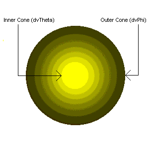
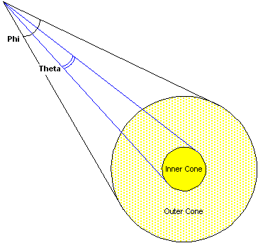

# Spot Light




저번에 했던 PointLight와는 다르게 콘 형식으로 빛이 나온다.

앞으로 가고 있는 빛과 현재 물체의 각 픽셀의 빛을 내적을 해서 현재의 빛을 구해준다.

## Shader
PointLight와 비슷하다.
```
struct SpotLight
{
    float4 Ambient;
    // 주 빛의 색
    float4 Diffuse;
    float4 Specular;
    float4 Emissive;
    
    float3 Position;
    float Range;
    
    float3 Direction;
    float Angle;
    
    float Intensity;
    float3 Padding;
};
```
및의 방향과 각도를 설정해준다.

```
void ComputeSpotLight(inout MaterialDesc output, float3 normal, float3 wPosition)
{
    output = MakeMaterial();
    MaterialDesc result = MakeMaterial();
    
    // Light 갯수만큼 for문을 돌아준다.(현재 최대 256개)
    // [unroll(MAX_POINT_LIGHTS)] -> 실행속도는 빨라지지만, 컴파일 속도는 느려진다.
    for (uint i = 0; i < SpotLightCount; i++)
    {
        // wPosition : 레스터라이징이 되어 있는 정점의 위치
        // PointLight의 위치에서 정점 위치까지의 거리를 구하기
        float3 light = SpotLights[i].Position - wPosition;
        float dist = length(light);
        
        // 거리거 PointLight의 범위를 넘어선다면 제외
        [flatten]
        if (dist > SpotLights[i].Range)
        {
            continue;
        }
        
        light /= dist; // Normalize
        
        // Ambient는 자신이 갖고있는 Ambient와 빛의 Ambient를 곱해주면 된다.
        result.Ambient = SpotLights[i].Ambient * Material.Ambient;
        
        // 이미 전역광에 대한 음영을 계산했지만, PointLight빛에 의해
        // 음영은 진해지기도 학도 빛에 의해 어두워 지는 부분 땜누에 PointLight에 대한 음영을 계산해준다. (빛은 누적됨)
        float NdotL = dot(light, normalize(normal));
        float3 E = normalize(ViewPosition() - wPosition); // 카메라가 바라보는 벡터
    
        // 조명각이 벗어났나 확인
        [flatten]
        if (NdotL > 0.0f)
        {
            result.Diffuse = Material.Diffuse * NdotL * SpotLights[i].Diffuse;
        
        // 강도가 0 이하라면 연산 할 필요가 없기 때문
            [flatten]
            if (Material.Specular.a > 0.0f)
            {
            // 반사식 중요
                // 전역광이 아닌 Light에 대한 반사 계산 (Specular 계산)
                float3 R = normalize(reflect(-light, normal));
                float RdotE = saturate(dot(R, E));

                float specular = pow(RdotE, Material.Specular.a);
                result.Specular = Material.Specular * specular * SpotLights[i].Specular;
            }
        }
    
        [flatten]
        if (Material.Emissive.a > 0.0f)
        {
            float NdotE = dot(E, normalize(normal));
            float emissive = smoothstep(1.0f - Material.Emissive.a, 1.0f, 1.0f - saturate(NdotE));
        
            result.Emissive = Material.Emissive * emissive * SpotLights[i].Emissive;
        }
        
        // 조명이 들어갈곳, 안들어갈 곳 감쇠를 하기
        // Range에 대한 Dist의 비율을 구한 후 역수로 뒤집어줌 (계산을 편하게 해줌)
        float temp = pow(saturate(dot(-light, SpotLights[i].Direction)), SpotLights[i].Angle);
        float att = temp * (1.0f - max(1.0f - SpotLights[i].Intensity, 1e-8f));

        // 빛 거리에 따른 감쇠(att)후 합산(빛은 합산할수록 밝아짐)
        output.Ambient += result.Ambient * temp;
        output.Diffuse += result.Diffuse * att;
        output.Specular += result.Specular * att;
        output.Emissive += result.Emissive * att;
    }
}
```
PointLight와 같지만 마지막에 값을 구하는 곳에서 조금 다르다

이번 SpotLight에서는 내적을 한 뒤, 0~1로 고정을 시킨 뒤 제곱을 해서 구해준다.

나머지 Perframe과 Light는 PointLight와 똑같이 진행해주면 된다.


