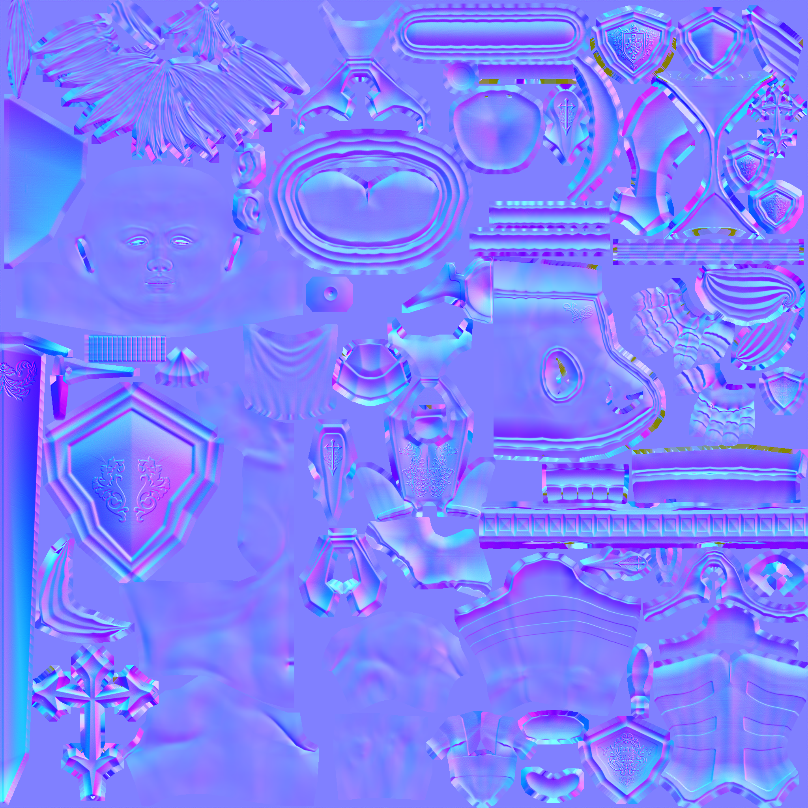
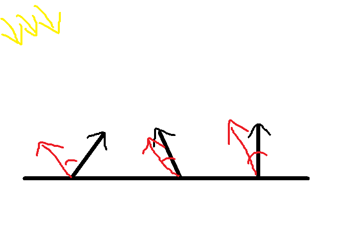

# NormalMap
물체를 표현할 때 음영에 따라 폴리곤을 만들면 그만큼 많은 자원이 들어가 퍼포먼스가 떨어진다.

그래서 NomalMap을 사용해서 음영을 나타낸다.



이 이미지가 NormalMap이다. 



이런 식으로 빛이 왔을때 내적각을 이용해 밝기를 표현한다.

일단 현재 받은 데이터는 2D 데이터이기 때문에 이 데이터를 3D 데이터로 변환해야 한다.

평면상의 노멀벡터는 Y축 모델 공간에서는 Z축이기 때문에 반대로 생각해야 한다.

일단, 받은 데이터는 UV로 받았다.

X : U - Tangent

Y : V - BiNormal or BiTangent (normal, tangent 외적값)

Z : Normal

이 데이터로는 Z축을 표현할 수 없기 때문에 계산을 해줘야 한다.


각 픽셀의 탄젠트 공간을 구한 후 그 공간의 수직인 방향(Normal)을 구한다.

이제 이 NormalVector와 현재 라이트를 내적하여 밝기를 구해준다.

위에 NormalMap을 보면 파란색이 많은 것을 볼 수 있는데 이는 굴곡을 만들 때 밝은 방향(Z축, B의 값)이 많기 때문이다.

## Shader
```
void NormalMapping(float2 uv, float3 normal, float3 tangent, SamplerState samp)
{
    float4 map = NormalMap.Sample(samp, uv);

    [flatten]
    if (any(map.rgb) == false)
    { return; }

    float3 coord = map.rgb * 2.0f - 1.0f; // -1 ~ +1
    
    // 탄젠트 공간
    float3 N = normalize(normal); // Z
    float3 T = normalize(tangent - dot(tangent, N) * N); // X 정규 직규화
    float3 B = cross(N, T); // Y
    
    float3x3 TBN = float3x3(T, B, N);

    coord = mul(coord, TBN);
    
    Material.Diffuse *= saturate(dot(-GlobalLight.Direction, coord));
}
```
위에 말한 개념을 바탕으로 NormalMapping하는 함수를 작성한다.

받은 Noraml값을 정규화 해준뒤, 그 값을 이용해 정규 직규화를 해준다.

그리고 외적을 통해 BiNormal을 구해준다.

```

float4 PS(MeshOutput input) : SV_Target
{    
    NormalMapping(input.Uv, input.Normal, input.Tangent);

    Texture(Material.Diffuse, DiffuseMap, input.Uv);
    Texture(Material.Specular, SpecularMap, input.Uv);
    
    MaterialDesc output = MakeMaterial();
    MaterialDesc result = MakeMaterial();
    
    ComputeLight(output, input.Normal, input.wPosition);
    AddMaterial(result, output);
    
    ComputePointLight(output, input.Normal, input.wPosition);
    AddMaterial(result, output);
    
    ComputeSpotLight(output, input.Normal, input.wPosition);
    AddMaterial(result, output);
    
    return float4(MaterialToColor(result), 1.0f);
}
```
적용을 시켜준다.

## Mesh
Mesh 에 있던 MeshVertex를
```
typedef VertexTextureNormal MeshVertex
```
Tangent를 사용해야 하기 때문에
```
typedef VertexTextureNormalTangent MeshVertex;
```
으로 변경해준다.

그런 뒤, 이에 맞게 Tangent값들은 cube, cylinder, grid, sphere에 바꿔준다.

이 중에 Sphere만 다뤄보자

### Sphere
```
Vector3 n;
D3DXVec3Normalize(&n, &p);

Vector3 t = Vector3
(
	-(radius * sinf(phi) * sinf(theta)),
	0.0f,
	(radius * sinf(phi) * cosf(theta))
);

Vector2 uv = Vector2(theta / (Math::PI * 2), phi / Math::PI);
			
v.push_back(MeshVertex(p.x, p.y, p.z, uv.x, uv.y, n.x, n.y, n.z, t.x, t.y, t.z));
```
현재 방향과 반대방향으로 uv를 만들어 준다.

이 상태로 NormalMap을 적용해주면


음영이 만들어지는데 차이를 못느낄것 같아 각각 적용한 모습을 따로 뽑아봤다.


아무것도 적용 안한 상태


텍스처만 적용한 상태


Normal Map만 적용한 상태


전체를 적용한 상태

확실히 음영이 잘 나타난다.