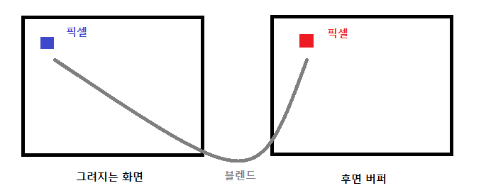

# AlphaBlend
현재 그릴 픽셀과 그려져 있는 픽셀 이 두 픽셀의 값을 결합하는 방식을 블렌딩이라고 한다.



간단하게 식을 보면

SrcColor - 그릴 픽셀 색상

Src - 그릴 픽셀의 Alpha

DestColor - 그려져 있는 픽셀 색상

Dest - Inverse Src Alpha

SrcColor * src OP DestColor * Dest

만약 SrcColor가 (1, 0, 0) 이고 Alpha가 0.2,

DestColor가 (0, 0, 1) 일 경우

(1, 0, 0) * 0.2 + (0, 0, 1) * (1 - 0.2) = (0.2, 0, 0.8)

(0.2, 0, 0.8) 이 색이 나온다.

DirectX에 이 블렌드를 담당하고 있는 구조체가 있다.

```
typedef struct D3D11_RENDER_TARGET_BLEND_DESC {
  BOOL           BlendEnable;
  D3D11_BLEND    SrcBlend;
  D3D11_BLEND    DestBlend;
  D3D11_BLEND_OP BlendOp;
  D3D11_BLEND    SrcBlendAlpha;
  D3D11_BLEND    DestBlendAlpha;
  D3D11_BLEND_OP BlendOpAlpha;
  UINT8          RenderTargetWriteMask;
} D3D11_RENDER_TARGET_BLEND_DESC;
```
[설명](https://docs.microsoft.com/en-us/windows/win32/api/d3d11/ns-d3d11-d3d11_render_target_blend_desc)

이 블렌딩을 활용해서 비와 눈을 만들어보자

## Shader
### 00_Global.fx

```
BlendState AlphaBlend
{
    AlphaToCoverageEnable = false;

    BlendEnable[0] = true;
    SrcBlend[0] = SRC_ALPHA;
    DestBlend[0] = INV_SRC_ALPHA;
    BlendOp[0] = ADD;

    SrcBlendAlpha[0] = One;
    DestBlendAlpha[0] = Zero;
    BlendOpAlpha[0] = Add;

    RenderTargetWriteMask[0] = 15; // 0x0F
};
```
이 블렌드 스테이트를 추가하자

위에서 설명한 수식을 이용해서 적어주자

AlphaToCoverageEnable 이것은 렌더 타겟에 픽셀값을 설정할 때의 알파값을 사용할지를 설정하는 값이다.

```
BlendState AlphaBlend_AlphaToCoverageEnable
{
    AlphaToCoverageEnable = true;

    BlendEnable[0] = true;
    SrcBlend[0] = SRC_ALPHA;
    DestBlend[0] = INV_SRC_ALPHA;
    BlendOp[0] = ADD;

    SrcBlendAlpha[0] = One;
    DestBlendAlpha[0] = Zero;
    BlendOpAlpha[0] = Add;

    RenderTargetWriteMask[0] = 15; // 0x0F
};

BlendState AdditiveBlend
{
    AlphaToCoverageEnable = false;

    BlendEnable[0] = true;
    SrcBlend[0] = One;
    DestBlend[0] = One;
    BlendOp[0] = ADD;

    SrcBlendAlpha[0] = One;
    DestBlendAlpha[0] = Zero;
    BlendOpAlpha[0] = Add;

    RenderTargetWriteMask[0] = 15; // 0x0F
};


BlendState AdditiveBlend_AlphaToCoverageEnable
{
    AlphaToCoverageEnable = true;

    BlendEnable[0] = true;
    SrcBlend[0] = One;
    DestBlend[0] = One;
    BlendOp[0] = ADD;

    SrcBlendAlpha[0] = One;
    DestBlendAlpha[0] = Zero;
    BlendOpAlpha[0] = Add;

    RenderTargetWriteMask[0] = 15; // 0x0F
};
```
알파 블렌드를 사용 안하는 설정도 추가해주자.

### Rain.fx

<details>
<summary>코드 보기</summary>
<div markdown="1">

```
#include "00_Global.fx"
#include "00_Light.fx"

cbuffer CB_Rain
{
    float4 Color;

    float3 Velocity;
    float DrawDistance;

    float3 Origin;
    float CB_Rain_Padding;

    float3 Extent;
};

struct VertexInput
{
    float4 Position : Position;
    float2 Uv : Uv;
    float2 Scale : Scale;
};

struct VertexOutput
{
    float4 Position : SV_Position;
    float2 Uv : Uv;
    float Alpha : Alpha;
};

VertexOutput VS(VertexInput input)
{
    VertexOutput output;
    
    float3 displace = Velocity;
    // xz는 크기만큼 비례해서 속도 늦춰지게 만듦
    displace.xz /= input.Scale.y * 0.1f;
    displace *= Time;
    
    // Extent범위를 넘어가면 다시 처음 있던 곳으로 간다. (순환)
    input.Position.xyz = Origin + (Extent + (input.Position.xyz + displace) % Extent) % Extent - (Extent * 0.5f);
    
    float4 position = WorldPosition(input.Position);

    float3 up = normalize(-Velocity);
    //float3 forward = float3(0, 0, 1);
    float3 forward = position.xyz - ViewPosition();
    float3 right = normalize(cross(up, forward));
    
    position.xyz += (input.Uv.x - 0.5f) * right * input.Scale.x;
    position.xyz += (1.0f - input.Uv.y - 0.5f) * up * input.Scale.y;
    position.w = 1.0f;
    
    output.Position = ViewProjection(position);
    output.Uv = input.Uv;
    
    float4 view = mul(position, View);
    output.Alpha = saturate(1 - view.z / DrawDistance) * 0.5f;
    
    return output;
}

float4 PS(VertexOutput input) : SV_Target
{
    float4 diffuse = DiffuseMap.Sample(LinearSampler, input.Uv);
    
    diffuse.rgb = Color.rgb * input.Alpha * 2.0f;
    diffuse.a = diffuse.a * input.Alpha * 1.5f;
    
    return diffuse;
}

technique11 T0
{
    P_BS_VP(P0, AlphaBlend, VS, PS)
    P_BS_VP(P1, AlphaBlend_AlphaToCoverageEnable, VS, PS)

    P_BS_VP(P2, AdditiveBlend, VS, PS)
    P_BS_VP(P3, AdditiveBlend_AlphaToCoverageEnable, VS, PS)
}
```

</div>
</details>

비가 내리는 위치에서 정해진 범위만큼 순환해서 뿌려준다.

그런 뒤, 현재 투명값을 카메라의 거리에 따라 흐리게 만들어준다.

## c++

<details>
<summary>Rain.h</summary>
<div markdown="1">

```
#pragma once

class Rain : public Renderer
{
public:
	Rain(Vector3& extent, UINT count, wstring file);
	~Rain();

	void Update();
	void Render();

private:
	struct Desc
	{
		D3DXCOLOR Color = D3DXCOLOR(1, 1, 1, 1);

		Vector3 Velocity = Vector3(-10, -100, 0);
		float DrawDistance = 0;

		Vector3 Origin = Vector3(0, 0, 0);
		float Padding;

		Vector3 Extent = Vector3(0, 0, 0);
		float Padding2;
	} desc;

private:
	struct VertexRain
	{
		Vector3 Position;
		Vector2 Uv;
		Vector2 Scale;
	};
	
private:
	ConstantBuffer* buffer;
	ID3DX11EffectConstantBuffer* sBuffer;

	VertexRain* vertices;
	UINT* indices;

	Texture* texture;
	UINT drawCount = 100;
};
```

</div>
</details>

<details>
<summary>Rain.h</summary>
<div markdown="1">

</div>
</details>