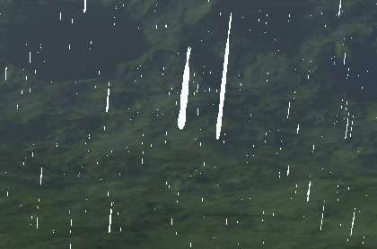

## Shader

### Rain.fx

<details>
<summary>코드 보기</summary>
<div markdown="1">

```
#include "00_Global.fx"
#include "00_Light.fx"

cbuffer CB_Rain
{
    float4 Color;

    float3 Velocity;
    float DrawDistance;

    float3 Origin;
    float CB_Rain_Padding;

    float3 Extent;
};

struct VertexInput
{
    float4 Position : Position;
    float2 Uv : Uv;
    float2 Scale : Scale;
};

struct VertexOutput
{
    float4 Position : SV_Position;
    float2 Uv : Uv;
    float Alpha : Alpha;
};

VertexOutput VS(VertexInput input)
{
    VertexOutput output;
    
    float3 displace = Velocity;
    // xz는 크기만큼 비례해서 속도 늦춰지게 만듦
    displace.xz /= input.Scale.y * 0.1f;
    displace *= Time;
    
    // Extent범위를 넘어가면 다시 처음 있던 곳으로 간다. (순환)
    input.Position.xyz = Origin + (Extent + (input.Position.xyz + displace) % Extent) % Extent - (Extent * 0.5f);
    
    float4 position = WorldPosition(input.Position);

    float3 up = normalize(-Velocity);
    //float3 forward = float3(0, 0, 1);
    float3 forward = position.xyz - ViewPosition();
    float3 right = normalize(cross(up, forward));
    
    position.xyz += (input.Uv.x - 0.5f) * right * input.Scale.x;
    position.xyz += (1.0f - input.Uv.y - 0.5f) * up * input.Scale.y;
    position.w = 1.0f;
    
    output.Position = ViewProjection(position);
    output.Uv = input.Uv;
    
    float4 view = mul(position, View);
    output.Alpha = saturate(1 - view.z / DrawDistance) * 0.5f;
    
    return output;
}

float4 PS(VertexOutput input) : SV_Target
{
    float4 diffuse = DiffuseMap.Sample(LinearSampler, input.Uv);
    
    diffuse.rgb = Color.rgb * input.Alpha * 2.0f;
    diffuse.a = diffuse.a * input.Alpha * 1.5f;
    
    return diffuse;
}

technique11 T0
{
    P_BS_VP(P0, AlphaBlend, VS, PS)
    P_BS_VP(P1, AlphaBlend_AlphaToCoverageEnable, VS, PS)

    P_BS_VP(P2, AdditiveBlend, VS, PS)
    P_BS_VP(P3, AdditiveBlend_AlphaToCoverageEnable, VS, PS)
}
```

</div>
</details>

비가 내리는 위치에서 정해진 범위만큼 순환해서 뿌려준다.

그런 뒤, 현재 투명값을 카메라의 거리에 따라 흐리게 만들어준다.

## c++

<details>
<summary>Rain.h</summary>
<div markdown="1">

```
#pragma once

class Rain : public Renderer
{
public:
	Rain(Vector3& extent, UINT count, wstring file);
	~Rain();

	void Update();
	void Render();

private:
	struct Desc
	{
		D3DXCOLOR Color = D3DXCOLOR(1, 1, 1, 1);

		Vector3 Velocity = Vector3(-10, -100, 0);
		float DrawDistance = 0;

		Vector3 Origin = Vector3(0, 0, 0);
		float Padding;

		Vector3 Extent = Vector3(0, 0, 0);
		float Padding2;
	} desc;

private:
	struct VertexRain
	{
		Vector3 Position;
		Vector2 Uv;
		Vector2 Scale;
	};
	
private:
	ConstantBuffer* buffer;
	ID3DX11EffectConstantBuffer* sBuffer;

	VertexRain* vertices;
	UINT* indices;

	Texture* texture;
	UINT drawCount = 100;
};
```

</div>
</details>

<details>
<summary>Rain.cpp</summary>
<div markdown="1">

```
#include "Framework.h"
#include "Rain.h"

Rain::Rain(Vector3 & extent, UINT count, wstring file)
	: Renderer(L"85_Rain.fxo"),drawCount(count)
{
	desc.Extent = extent;
	desc.DrawDistance = desc.Extent.z * 2.0f;

	texture = new Texture(file);
	shader->AsSRV("DiffuseMap")->SetResource(texture->SRV());

	buffer = new ConstantBuffer(&desc, sizeof(Desc));
	sBuffer = shader->AsConstantBuffer("CB_Rain");


	vertices = new VertexRain[drawCount * 4];
	for (UINT i = 0; i < drawCount * 4; i += 4)
	{
		Vector2 scale;
		scale.x = Math::Random(0.1f, 0.4f);
		scale.y = Math::Random(2.0f, 6.0f);

		Vector3 position;
		position.x = Math::Random(-desc.Extent.x, desc.Extent.x);
		position.y = Math::Random(-desc.Extent.y, desc.Extent.y);
		position.z = Math::Random(-desc.Extent.z, desc.Extent.z);


		vertices[i + 0].Position = position;
		vertices[i + 1].Position = position;
		vertices[i + 2].Position = position;
		vertices[i + 3].Position = position;

		vertices[i + 0].Uv = Vector2(0, 1);
		vertices[i + 1].Uv = Vector2(0, 0);
		vertices[i + 2].Uv = Vector2(1, 1);
		vertices[i + 3].Uv = Vector2(1, 0);

		vertices[i + 0].Scale = scale;
		vertices[i + 1].Scale = scale;
		vertices[i + 2].Scale = scale;
		vertices[i + 3].Scale = scale;
	}

	indices = new UINT[drawCount * 6];
	for (UINT i = 0; i < drawCount; i++)
	{
		indices[i * 6 + 0] = i * 4 + 0;
		indices[i * 6 + 1] = i * 4 + 1;
		indices[i * 6 + 2] = i * 4 + 2;
		indices[i * 6 + 3] = i * 4 + 2;
		indices[i * 6 + 4] = i * 4 + 1;
		indices[i * 6 + 5] = i * 4 + 3;
	}

	vertexBuffer = new VertexBuffer(vertices, drawCount * 4, sizeof(VertexRain));
	indexBuffer = new IndexBuffer(indices, drawCount * 6);

	//D3D11_BLEND_DESC desc;
}

Rain::~Rain()
{
	SafeDelete(buffer);

	SafeDeleteArray(vertices);
	SafeDeleteArray(indices);

	SafeDelete(texture);
}

void Rain::Update()
{
	Super::Update();

	Context::Get()->GetCamera()->Position(&desc.Origin);
	ImGui::SliderFloat3("Origin", desc.Origin, 0, 200);

	ImGui::SliderFloat3("Velocity", desc.Velocity, -200, 200);
	ImGui::ColorEdit3("Color", desc.Color);
	ImGui::SliderFloat("Distance", &desc.DrawDistance, 0, desc.Extent.z * 2.0f);
}

void Rain::Render()
{
	Super::Render();

	buffer->Render();
	sBuffer->SetConstantBuffer(buffer->Buffer());

	static UINT pass = 0;
	ImGui::InputInt("Rain Pass", (int*)&pass);
	pass %= 4;
	
	shader->DrawIndexed(0, pass, drawCount * 6);
}
```

</div>
</details>

그리고 각각의 값들을 바꿀 수 있게 만들어주고 이 Rain을 생성을하면




AlphaBlend, AlphaToCoverageEnable = false


AlphaBlend, AlphaToCoverageEnable = true


AdditiveBlend, AlphaToCoverageEnable = false


AdditiveBlend, AlphaToCoverageEnable = true