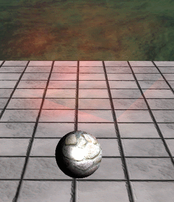

# Particle
이 전에는 파일을 읽어서 색상, 시간등 Input Data값을 갖고왔다.

이젠 Shader작성을 해보자

## Shader

<details>
<summary>00_Global.fx</summary>
<div markdown="1">

```
BlendState OpaqueBlend
{
    BlendEnable[0] = true;
    SrcBlend[0] = One;
    DestBlend[0] = Zero;
    BlendOp[0] = ADD;
    
    SrcBlendAlpha[0] = One;
    DestBlendAlpha[0] = Zero;
    BlendOpAlpha[0] = Add;
    
    RenderTargetWriteMask[0] = 15; //Ox0F
};

BlendState AdditiveBlend_Particle
{
    AlphaToCoverageEnable = false;
    
    BlendEnable[0] = true;
    SrcBlend[0] = SRC_ALPHA;
    DestBlend[0] = One;
    BlendOp[0] = ADD;
    
    SrcBlendAlpha[0] = One;
    DestBlendAlpha[0] = Zero;
    BlendOpAlpha[0] = Add;
    
    RenderTargetWriteMask[0] = 15; //Ox0F
};
```

</div>
</details>

이 BlendState를 추가해주자

<details>
<summary>89_Particle.fx</summary>
<div markdown="1">

```
#include "00_Global.fx"

Texture2D ParticleMap;

struct ParticleDesc
{
    float4 MinColor;
    float4 MaxColor;
    
    float3 Gravity;
    float EndVelocity;
    
    float2 StartSize;
    float2 EndSize;
    
    float2 RotateSpeed;
    float ReadyTime;
    float ReadyRandomTime;
    
    float ColorAmount;
    float CurrentTime;
};

cbuffer CB_Particle
{
    ParticleDesc Particle;
};

struct VertexInput
{
    float4 Position : Position;
    float2 Corner : Uv;
    float3 Velocity : Velocity;
    float4 Random : Random; //x : 주기, y - 크기, z - 회전, w - 색상
    float Time : Time;
};

struct VertexOutput
{
    float4 Position : SV_Position;
    float4 Color : Color;
    float2 Uv : Uv;
};

float4 ComputePosition(float3 position, float3 velocity, float age, float normalizedAge /*정규화된 시간*/)
{
    float start = length(velocity);
    float end = start * Particle.EndVelocity;
    
    // 이동 시작해서 끝나는 방향 / 2
    // start -> (end-start) 까지
    float amount = start * normalizedAge + (end - start) * normalizedAge / 2;

    // 움직임을 적용시키기 위해 하나씩 곱함
    position += normalize(velocity) * amount * Particle.ReadyTime;
    position += Particle.Gravity * age * normalizedAge;
    
    return ViewProjection(float4(position, 1));
}

float ComputeSize(float value, float normalizedAge)
{
    float start = lerp(Particle.StartSize.x, Particle.StartSize.y, value);
    float end = lerp(Particle.EndSize.x, Particle.EndSize.y, value);
    
    return lerp(start, end, normalizedAge); 
}

float2x2 ComputeRotation(float value, float age)
{
    float angle = lerp(Particle.RotateSpeed.x, Particle.RotateSpeed.y, value);
    float radian = angle * age;
    
    float c = cos(radian);
    float s = sin(radian);

    return float2x2(c, -s, s, c);
}

float4 ComputeColor(float value, float normalizedAge)
{
    float4 color = lerp(Particle.MinColor, Particle.MaxColor, value)* normalizedAge;
    return color * Particle.ColorAmount;
}

VertexOutput VS(VertexInput input)
{
    VertexOutput output;
    
    float age = Particle.CurrentTime - input.Time;
    age *= input.Random.x * Particle.ReadyRandomTime + 1;
    
    float normalizedAge = saturate(age / Particle.ReadyTime);
    
    
    output.Position = ComputePosition(input.Position.xyz, input.Velocity, age, normalizedAge);
    
    float size = ComputeSize(input.Random.y, normalizedAge);
    float2x2 rotation = ComputeRotation(input.Random.z, age);
    
    output.Position.xy += mul(input.Corner, rotation) * size * 0.5f;
    
    output.Uv = (input.Corner + 1.0f) * 0.5f;
    output.Color = ComputeColor(input.Random.w, normalizedAge);

    return output;
}

float4 PS(VertexOutput input) : SV_Target
{
    return ParticleMap.Sample(LinearSampler, input.Uv) * input.Color;
}

technique11 T0
{
    P_BS_VP(P0, OpaqueBlend, VS, PS)
    P_BS_VP(P1, AdditiveBlend_Particle, VS, PS)
    P_BS_VP(P2, AlphaBlend, VS, PS)
}
```
</div>
</details>

GPU에서 받아올  Desc를 작성한 뒤, 

VS 단계에서 각 픽셀의 위치와 크기, 회전값, 그리고 색상을 계산해주자.

이렇게 하면



이펙트는 나오는데 뭔가 이상하다. 계속 잘려 나온다.
