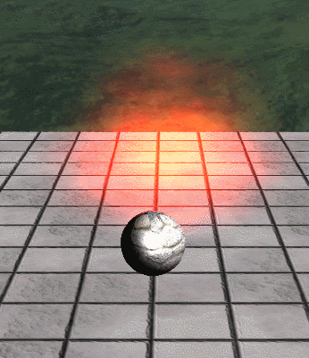

# Depth
DirectX의 파이프라인중 OM 단계에서 지금까지 했던 Color와 Depth를 계산해서 값을 내보내준다.

그 중 Depth에서 몇가지 중요한 점이 있다.

## Z-Fighting

지금까지 그려준 이미지중 Depth가 만약 겹칠경우 


[출처](https://en.wikipedia.org/wiki/Z-fighting)

Z-Fighting 현상이 발생한다.

각 픽셀이 먼저 그려지겠다고 싸운다고 생각하면 편하다.

이 현상을 해결하는 방법은 많다.

각각의 투명값을 사용해서 먼저 그려질 순서를 정하는 방법도 있고, 깊이를 활용해서 그려주는 방법 등이 있다.

이번에는 깊이를 활용해서 그려주는 방법을 사용해보자

# Particle

## Shader

00_Global.fx
```
DepthStencilState DepthRead_Particle
{
    DepthEnable = true;

    DepthFunc = Less_Equal;
    DepthWriteMask = 0;
};
```
DepthStencilState를 활용한다.

각 변수에 관한 설명은 [참고](https://docs.microsoft.com/en-us/windows/win32/api/d3d11/ns-d3d11-d3d11_depth_stencil_desc) 이곳을 참고하면 된다.

이번에는 원본 데이터가 대상 데이터보다 깊이가 적을 경우 통과되는 방법이다.

89_Particle.fx
```
technique11 T0
{
    P_DSS_BS_VP(P0, DepthRead_Particle, OpaqueBlend, VS, PS)
    P_DSS_BS_VP(P1, DepthRead_Particle, AdditiveBlend_Particle, VS, PS)
    P_DSS_BS_VP(P2, DepthRead_Particle, AlphaBlend, VS, PS)
}
```

이렇게 한 뒤 다시 실행을 시키면




정상적이게 파티클이 출력된다.

지금은 반복적인 파티클이지만, 폭발이나 다른 마법처럼 그 순간에만 작동하는 파티클이 있다. 구현해보자

## C++
현재 ParticleData 구조체에 
```
bool bLoop = false;
```
을 추가시키고 

<details>
<summary>ParticleSystem.cpp</summary>
<div markdown="1">

```
void ParticleSystem::Add(Vector3 & position)
{
	if (Time::Get()->Running() - lastAddTime < 60.0f / 1000.0f)
	{
		return;
	}

	lastAddTime = Time::Get()->Running();


	UINT count = leadCount + 1;

	if (count >= data.MaxParticles)
	{
		if (data.bLoop == true)
		{
			count = 0;
		}
		else
		{
			count = data.MaxParticles;
			return;
		}
	}

	if (count == deactiveCount) { return; }


	Vector3 velocity = Vector3(1, 1, 1);
	velocity *= data.StartVelocity;

	float horizontalVelocity = Math::Lerp(data.MinHorizontalVelocity, data.MaxHorizontalVelocity, Math::Random(0.0f, 1.0f));
	float horizontalAngle = Math::PI * 2.0f * Math::Random(0.0f, 1.0f);

	velocity.x += horizontalVelocity * cosf(horizontalAngle);
	velocity.y += horizontalVelocity * sinf(horizontalAngle);
	velocity.z += Math::Lerp(data.MinHorizontalVelocity, data.MaxHorizontalVelocity, Math::Random(0.0f, 1.0f));

	Vector4 random = Math::RandomVec4(0.0f, 1.0f);

	for (UINT i = 0; i < 4; i++)
	{
		vertices[leadCount * 4 + i].Position = position;
		vertices[leadCount * 4 + i].Velocity = velocity;
		vertices[leadCount * 4 + i].Random = random;
		vertices[leadCount * 4 + i].Time = currentTime;
	}

	leadCount = count;
}

void ParticleSystem::Activate()
{
	while (activeCount != gpuCount)
	{
		float age = currentTime - vertices[activeCount * 4].Time;

		if (age < data.ReadyTime) { return; }

		vertices[activeCount * 4].Time = currentTime;
		activeCount++;

		if (activeCount >= data.MaxParticles)
		{
			activeCount = (data.bLoop == true) ? 0 : data.MaxParticles;
		}
	}
}

void ParticleSystem::Deactivate()
{
	while (activeCount != deactiveCount)
	{
		float age = currentTime - vertices[deactiveCount * 4].Time;

		if (age > data.ReadyTime) { return; }

		deactiveCount++;

		if (deactiveCount >= data.MaxParticles)
		{
			deactiveCount = (data.bLoop == true) ? 0 : data.MaxParticles;
		}
	}
}
```

</div>
</details>

루프 해주는 부분을 변경해주자

이렇게 하면


(와 너무 순간이라 찍기 힘들었다....)

잘 나온다.
