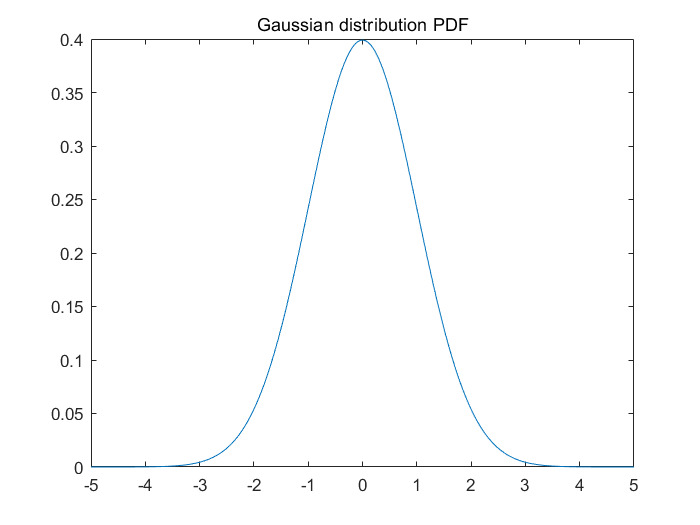

# GaussianBlur
이 전에는 Blur 처리를 간단한 방법으로 만들었지만, 좀 더 자연스럽게 만들기 위해 Gaussian함수를 사용해서 만들어 보자




이 분포가 가우시안 분포도이다. 이 분포도를 활요해서 중간 부분을 좀 더 강하게 블러 해준다.

## Shader
<details>
<summary>104_GaussianBlur.fx</summary>
<div markdown="1">

```
#include "00_Global.fx"
#include "00_Light.fx"

float2 PixelSize;

struct VertexOutput
{
    float4 Position : SV_Position;
    float2 Uv : UV;
};

VertexOutput VS(float4 Position : Position)
{
    VertexOutput output;
    
    output.Position = Position;
    output.Uv.x = Position.x * 0.5f + 0.5f;
    output.Uv.y = -Position.y * 0.5f + 0.5f;
    
    return output;
}

float4 PS_Diffuse(VertexOutput intput) : SV_Target
{
    return DiffuseMap.Sample(LinearSampler, intput.Uv);
}

const int GaussBlurCount = 6;
static const float Weights[13] =
{
    0.0561f, 0.1353f, 0.2780f, 0.4868f, 0.7261f, 0.9231f,
    1.0f,
    0.9231f, 0.7261f, 0.4868f, 0.2780f, 0.1353f, 0.0561f
};

float4 PS_GausianBlurX(VertexOutput input) : SV_Target
{
    float2 uv = input.Uv;
    float u = PixelSize.x;
    
    float sum = 0;
    float4 color = 0;
    for (int i = -GaussBlurCount; i < GaussBlurCount; i++)
    {
        float2 temp = uv + float2(u * (float) i, 0.0f);
        color += Weights[6 + i] * DiffuseMap.Sample(LinearSampler, temp);
        
        sum += Weights[6 + i];
    }
    color /= sum;

    return float4(color.rgb, 1.0f);
}

float4 PS_GaussianBlurY(VertexOutput input) : SV_Target
{
    float2 uv = input.Uv;
    float v = PixelSize.y;
    
    float sum = 0;
    float4 color = 0;
    for (int i = -GaussBlurCount; i <= +GaussBlurCount; i++)
    {
        float2 temp = uv + float2(0.0f, v * (float) i);
        color += Weights[6 + i] * DiffuseMap.Sample(LinearSampler, temp);
        
        sum += Weights[6 + i];
    }
    color /= sum;
    
    return float4(color.rgb, 1);
}

struct PixelOutput_GaussianBlur2
{
    float4 Color0 : SV_Target0;
    float4 Color1 : SV_Target1;
};

PixelOutput_GaussianBlur2 PS_GaussianBlurMrt(VertexOutput input)
{
    PixelOutput_GaussianBlur2 output;

    float2 uv = input.Uv;
    float u = PixelSize.x;
    
    float sum = 0;
    float4 color = 0;
    for (int i = -GaussBlurCount; i < GaussBlurCount; i++)
    {
        float2 temp = uv + float2(u * (float) i, 0.0f);
        color += Weights[6 + i] * DiffuseMap.Sample(LinearSampler, temp);
        
        sum += Weights[6 + i];
    }
    color /= sum;
    
    output.Color0 = float4(color.rgb, 1);
    
    uv = input.Uv;
    float v = PixelSize.y;
    
    sum = 0;
    color = 0;
    for (int j = -GaussBlurCount; j <= +GaussBlurCount; j++)
    {
        float2 temp = uv + float2(0.0f, v * (float) j);
        color += Weights[6 + j] * DiffuseMap.Sample(LinearSampler, temp);
        
        sum += Weights[6 + j];
    }
    color /= sum;
    
    output.Color1 = float4(color.rgb, 1);
    
    return output;
}

Texture2D GaussianMrt[2];
float4 PS_GaussianCombined(VertexOutput input) : SV_Target
{
    float4 color0 = GaussianMrt[0].Sample(LinearSampler, input.Uv);
    float4 color1 = GaussianMrt[1].Sample(LinearSampler, input.Uv);
    
    return float4((color0.rgb + color1.rgb) * 0.5f, 1.0f);
}

technique11 T0
{
    P_VP(P0, VS, PS_Diffuse)
    P_VP(P1, VS, PS_GausianBlurX)
    P_VP(P2, VS, PS_GaussianBlurY)
    P_VP(P3, VS, PS_GaussianBlurMrt)
    P_VP(P4, VS, PS_GaussianCombined)
}
```

</div>
</details>

X축과 Y축을 계산한 뒤, 그 값들을 섞어준다.

## GaussianBlur Class+
<details>
<summary>GaussianBlur2.cpp</summary>
<div markdown="1">

```
void GaussianBlurDemo2::Initialize()
{
	Context::Get()->GetCamera()->RotationDegree(20, 0, 0);
	Context::Get()->GetCamera()->Position(1, 36, -85);
	((Freedom *)Context::Get()->GetCamera())->Speed(50,2);

	Performance performence;
	shader = new Shader(L"96_Billboard.fxo");

	float width = D3D::Width(), height = D3D::Height();

	renderTarget[0] = new RenderTarget((UINT)width, (UINT)height);
	renderTarget[1] = new RenderTarget((UINT)width, (UINT)height);
	renderTarget[2] = new RenderTarget((UINT)width, (UINT)height);

	depthStencil = new DepthStencil((UINT)width, (UINT)height);
	viewport = new Viewport(D3D::Width(), D3D::Height());

	render2D = new Render2D();
	render2D->GetTransform()->Scale(355.0f, 200.0f, 1);
	render2D->GetTransform()->Position(200.0f ,150.0f , 0);
	render2D->SRV(renderTarget[0]->SRV());

	postEffect = new PostEffect(L"104_GaussianBlur.fxo");
		
	sky = new CubeSky(L"Environment/GrassCube1024.dds");

	Billboards();

	Mesh();
	Airplane();
	Kachujin();
	KachujinCollider();
	KachujinWeapon();

	PointLighting();
	SpotLighting();
}

void GaussianBlurDemo2::PreRender()
{
	renderTarget[0]->PreRender(depthStencil);
	viewport->RSSetViewport();

	// Render
	{
		sky->Render();

		Pass(0, 1, 2);

		wall->Render();
		sphere->Render();

		brick->Render();
		cylinder->Render();

		stone->Render();
		cube->Render();

		floor->Render();
		grid->Render();

		airplane->Render();

		kachujin->Render();
		weapon->Render();

		billboard->Render();
	}


	Vector2 PixelSize = Vector2(1.0f / D3D::Width(), 1.0f / D3D::Height());
	postEffect->GetShader()->AsVector("PixelSize")->SetFloatVector(PixelSize);

	// MRT
	{
		RenderTarget* temp[2];
		temp[0] = renderTarget[1];
		temp[1] = renderTarget[2];

		RenderTarget::PreRender(temp, 2, depthStencil);

		postEffect->Pass(3);
		postEffect->SRV(renderTarget[0]->SRV());
		postEffect->Render();
	}

	// Combined
	{
		renderTarget[0]->PreRender(depthStencil);

		ID3D11ShaderResourceView* srvs[2];
		srvs[0] = renderTarget[1]->SRV();
		srvs[1] = renderTarget[2]->SRV();

		postEffect->Pass(4);
		postEffect->GetShader()->AsSRV("GaussianMrt")->SetResourceArray(srvs, 0, 2);
		postEffect->Render();
	}
}

void GaussianBlurDemo2::PostRender()
{
	postEffect->Pass(0);
	postEffect->SRV(renderTarget[0]->SRV());
	postEffect->Render();
	render2D->Render();
}
```
</div>
</details>

두개의 SRV를 받은 뒤, Shader의 Combine의 값으로 갖고온다.

이렇게 갖고오게 되면


