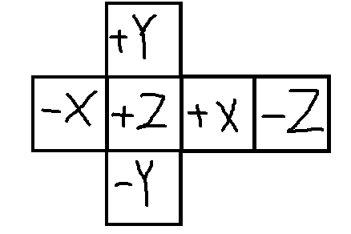

# DynamicCubeMap
실시간으로 큐브에 주변 환경을 매핑해서 보여주는 오브젝트이다.

각 큐브 방향에서 반사 된 색을 만들어서 보여주면 주변 환경을 알 수 있게 된다.




큐브에서 각 부분의 Normal벡터이다. 그리고 각 벡터의 기준으로 축의 방향이다.

## DynamicCubeMap Class

<details>
<summary>DynamicCubeMap.h</summary>
<div markdown="1">

```
#pragma once

class DynamicCubeMap
{
public:
	DynamicCubeMap(Shader* shader, UINT width, UINT height);
	~DynamicCubeMap();

	void PreRender(Vector3& position, Vector3& scale, float zNear = 0.1f, float zFar = 500.0f, float fov = 0.5f);
	void Type(UINT val) { desc.Type = val; }
	UINT& Type() { return desc.Type; }

	ID3D11ShaderResourceView*  SRV() { return srv; }
	Perspective* GetPerspective() { return perspective; }

private:
	struct Desc
	{
		UINT Type = 0;
		float Padding[3];

		Matrix Views[6];
		Matrix Projection;
	}desc;

private:
	Shader* shader;
	Vector3 position;

	UINT width, height;

	ID3D11Texture2D* rtvTexture;
	ID3D11RenderTargetView* rtv;
	ID3D11ShaderResourceView* srv;

	ID3D11Texture2D* dsvTexture;
	ID3D11DepthStencilView* dsv;

	Perspective* perspective;
	Viewport* viewport;

	class ConstantBuffer* buffer;
	ID3DX11EffectConstantBuffer* sBuffer = NULL;
};
```

</div>
</details>

<details>
<summary>DynamicCubeMap.cpp</summary>
<div markdown="1">

```
#include "Framework.h"
#include "DynamicCubeMap.h"

DynamicCubeMap::DynamicCubeMap(Shader * shader, UINT width, UINT height)
	: shader(shader), position(0, 0, 0), width(width), height(height)
{
	DXGI_FORMAT rtvFormat = DXGI_FORMAT_R8G8B8A8_UNORM;

	// Create Texture2D - RTV
	{
		D3D11_TEXTURE2D_DESC desc;
		ZeroMemory(&desc, sizeof(D3D11_TEXTURE2D_DESC));
		desc.Width = width;
		desc.Height = height;
		desc.ArraySize = 6;
		desc.Format = rtvFormat;
		desc.BindFlags = D3D11_BIND_SHADER_RESOURCE | D3D11_BIND_RENDER_TARGET;
		// 이걸 사용해줘야 큐브맵 세팅 가능해짐
		desc.MiscFlags = D3D11_RESOURCE_MISC_TEXTURECUBE;
		desc.MipLevels = 1;
		desc.SampleDesc.Count = 1;

		Check(D3D::GetDevice()->CreateTexture2D(&desc, NULL, &rtvTexture));
	}

	// Create RTV
	{
		D3D11_RENDER_TARGET_VIEW_DESC desc;
		ZeroMemory(&desc, sizeof(D3D11_RENDER_TARGET_VIEW_DESC));
		desc.Format = rtvFormat;
		desc.ViewDimension = D3D11_RTV_DIMENSION_TEXTURE2DARRAY;
		desc.Texture2DArray.ArraySize = 6;

		Check(D3D::GetDevice()->CreateRenderTargetView(rtvTexture, &desc, &rtv));
	}

	// Create SRV
	{
		D3D11_SHADER_RESOURCE_VIEW_DESC desc;
		ZeroMemory(&desc, sizeof(D3D11_SHADER_RESOURCE_VIEW_DESC));
		desc.Format = rtvFormat;
		//  셰이더에선 TextureCube
		desc.ViewDimension = D3D11_SRV_DIMENSION_TEXTURECUBE;
		desc.TextureCube.MipLevels = 1;

		Check(D3D::GetDevice()->CreateShaderResourceView(rtvTexture, &desc, &srv));
	}

	DXGI_FORMAT dsvFormat = DXGI_FORMAT_D32_FLOAT;
	//Create Texture - DSV
	{
		D3D11_TEXTURE2D_DESC desc;
		ZeroMemory(&desc, sizeof(D3D11_TEXTURE2D_DESC));
		desc.Width = width;
		desc.Height = height;
		desc.ArraySize = 6;
		desc.Format = dsvFormat;
		desc.BindFlags = D3D11_BIND_DEPTH_STENCIL;
		desc.MiscFlags = D3D11_RESOURCE_MISC_TEXTURECUBE;
		desc.MipLevels = 1;
		desc.SampleDesc.Count = 1;

		Check(D3D::GetDevice()->CreateTexture2D(&desc, NULL, &dsvTexture));
	}

	//CreateDSV
	{
		D3D11_DEPTH_STENCIL_VIEW_DESC desc;
		ZeroMemory(&desc, sizeof(D3D11_DEPTH_STENCIL_VIEW_DESC));
		desc.Format = dsvFormat;
		desc.ViewDimension = D3D11_DSV_DIMENSION_TEXTURE2DARRAY;
		desc.Texture2DArray.ArraySize = 6;

		Check(D3D::GetDevice()->CreateDepthStencilView(dsvTexture, &desc, &dsv));
	}

	viewport = new Viewport((float)width, (float)height);
	buffer = new ConstantBuffer(&desc, sizeof(Desc));
	sBuffer = shader->AsConstantBuffer("CB_DynamicCube");
}

DynamicCubeMap::~DynamicCubeMap()
{
	SafeDelete(rtvTexture);
	SafeDelete(srv);
	SafeDelete(rtv);

	SafeRelease(dsvTexture);
	SafeRelease(dsv);

	SafeDelete(viewport);
	SafeDelete(buffer);
}

void DynamicCubeMap::PreRender(Vector3 & position, Vector3 & scale, float zNear, float zFar, float fov)
{
	this->position = position;

	// Create View
	{
		float x = position.x;
		float y = position.y;
		float z = position.z;

		struct LookAt
		{
			Vector3 LookAt;
			Vector3 Up;
		} lookAt[6];

		lookAt[0] = { Vector3(x + scale.x, y, z), Vector3(0, +1, 0) };
		lookAt[1] = { Vector3(x - scale.x, y, z), Vector3(0, +1, 0) };
		lookAt[2] = { Vector3(x , y + scale.y, z), Vector3(0, 0, -1) };
		lookAt[3] = { Vector3(x , y - scale.y, z), Vector3(0, 0, +1) };
		lookAt[4] = { Vector3(x , y, z + scale.z), Vector3(0, +1, 0) };
		lookAt[5] = { Vector3(x , y, z - scale.z), Vector3(0, +1, 0) };

		for (UINT i = 0; i < 6; i++)
		{
			D3DXMatrixLookAtLH(&desc.Views[i], &position, &lookAt[i].LookAt, &lookAt[i].Up);
		}
	}

	// 정투영을 하기 위해 1:1 로 만듦
	perspective = new Perspective(1, 1, zNear, zFar, Math::PI * fov);
	perspective->GetMatrix(&desc.Projection);

	buffer->Render();
	sBuffer->SetConstantBuffer(buffer->Buffer());


	D3D::Get()->SetRenderTarget(rtv, dsv);
	D3D::Get()->Clear(Color(0, 0, 0, 1), rtv, dsv);

	viewport->RSSetViewport();
}

```

</div>
</details>

PreRender 이 함수만 설명하면 나머지는 지금까지 했던 것들과 같다

큐브의 각 부분의 Normal벡터 값을 구한 뒤, 위의 방향을 구해준다.

그런 뒤, 각 부분에서 보고있는 행렬을 구해준다.

이 행렬을 정투영을 하기 위해 Width와 Height를 1대 1로 만들어준다.