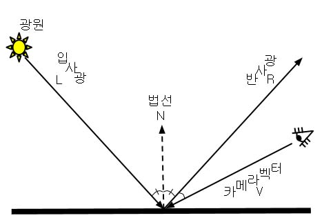
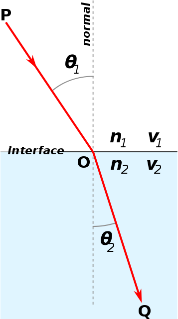

# DynamicCubeMap

## 반사

지금은 이 물체가 난반사를 일으키는 일은 없으므로 정반사광을 사용한다.



반사광과 카메라 벡터가 이루는 각도의 코사인 값을 구하고 그 결과를 여러번 거듭제곱하여 정반사광을 얻을 수 있다.

하지만, 우리는 reflect라는 내장 함수를 사용해서 결과를 계산한다.

## 굴절


빛이 기존의 매질로 부터 새로운 물질로 진행할 때, 매질의 밀도차이에 의해 속도 차이가 생겨 빛이 꺾이는 현상이다.

* 굴절률 : n = c / v
	- c : 진공에서의 빛의 속도
	- v : 어떤 특정 매질 안에서의 빛의 속도
	- v는 c보다 항상 작다. 따라서 n은 항상 1보다 크다

Refract라는 내장 함수를 사용해서 결과를 계산한다.

## 플레넬 방정식
반사와 굴절을 좀 더 명확하게 표현하기 위해 플레넬 방정식을 사용한다.



여기석 붉은 라인은 빛의 경로다. 매질으 ㅣ경계에서 빛이 굴절한다. 표면의 노멀과 입사광의 각은 θ1 이다. 그리고 노멀과 굴절광의 각은 θ2 이다. v는 속도,
 λ은 파장을 의미한다.

 이것들의 관계를 설명한 것이 플레넬의 법칙이다.

 

 빛이 굴절률이 다른 매질을 만나게 되면 특정 각도에서는 굴절을 하지 않고 완전히 반사를 하는 경우가 있다.


위의 그림에서 Critical angle이라고 된 각도를 넘어서면 전반사가 발생한다.


전반사를 구하는 공식이다.

반사와 굴절의 계산하기 위해서는 얼마만큼의 빛이 반사되고 얼마만큼의 빛이 굴절되는지 알아야 한다. 그것을 알려주는 공식이 플레넬 방정식이다.

플레넬의 방정식이 매우 어렵기 때문에 그래픽스에서 사용하는 근사 계산 공식만 알아보겠다.


위의 공식을 사용한 결과이다.

정확한 값을 원하면 모든 매질의 굴절률 값을 넣어서 계산하면 된다.


위의 공식에 값을 넣으면 된다.


## Shader
큐브맵을 DXD에서 직접 그려줘도 괜찮긴 하지만, 각 면마다 정점을 찍어야 하기 때문에 메모리 낭비가 심하다 따라서 Geometry Shader를 이용해서 만들어 주자.

<details>
<summary>107_DynamicCubeMap.fx</summary>
<div markdown="1">

```
cbuffer CB_DynamicCube
{
    uint CubeRenderType;
    float3 CB_DynamicCube_Padding;
    
    matrix CubeViews[6];
    matrix CubeProjection;
};

[maxvertexcount(18)]
void GS_PreRender(triangle MeshOutput input[3], inout TriangleStream<MeshGeometryOutput> stream)
{
    int vertex = 0;
    MeshGeometryOutput output;
    
    [unroll(6)]
    for (int i = 0; i < 6; i++)
    {
        output.TargetIndex = i;
        
        [unroll(3)]
        for (int vertex = 0; vertex < 3; vertex++)
        {
            output.Position = mul(float4(input[vertex].wPosition, 1), CubeViews[i]);
            output.Position = mul(output.Position, CubeProjection);
            
            output.oPosition = input[vertex].oPosition;
            output.wPosition = input[vertex].wPosition;
            output.Normal = input[vertex].Normal;
            output.Tangent = input[vertex].Tangent;
            output.Uv = input[vertex].Uv;
            output.Color = input[vertex].Color;
            
            stream.Append(output);
        }

        stream.RestartStrip();
    }
}

float4 PS_PreRender_Sky(MeshGeometryOutput input) : SV_Target
{
    return PS_Sky(ConvertMeshOutput(input));
}

float4 PS_PreRender(MeshGeometryOutput input) : SV_Target
{
    return PS_AllLight(ConvertMeshOutput(input));
}

TextureCube DynamicCubeMap;
float RefractionAmount = 1.0f;
float RefractionAlpha = 0.75f;

float CubeMapAmount = 0.2f;
float CubeMapBias = 0.2f;
float CubeMapScale = 0.2f;

float4 PS_CubeMap(MeshOutput input) : SV_Target
{
    float4 color = 0;
    
    float3 view = normalize(input.wPosition - ViewPosition());
    float3 normal = normalize(input.Normal);
    float3 reflection = reflect(view, normal);
    
    
    float3 refraction = refract(view, normal, RefractionAmount);
    
    float4 diffuse = 0;
    
    if(CubeRenderType == 0)
    {
        color = DynamicCubeMap.Sample(LinearSampler, input.oPosition);
    }
    
    else if(CubeRenderType == 1)
    {
        color = DynamicCubeMap.Sample(LinearSampler, reflection);
    }    
    
    else if(CubeRenderType == 2)
    {
        color = DynamicCubeMap.Sample(LinearSampler, -refraction);
        
        color.a = RefractionAlpha;
    }
    
    else if (CubeRenderType == 3)
    {
        diffuse = PS_AllLight(input);
        color = DynamicCubeMap.Sample(LinearSampler, reflection);
        
        float4 fresnel = CubeMapBias + (1.0f - CubeMapScale) * pow(abs(1.0f - dot(view, normal)), CubeMapAmount);
        color = CubeMapAmount * diffuse + lerp(diffuse, color, fresnel);
        color.a = 1.0f;
    }
    
    return color;
}
```

</div>
</details>

이 전에 DynamicCubeMap에서 사용한 Desc의 Type마다 투영인지, 반사인지, 굴절인지, 플레넬 방정식을 사용한 굴절인지 구해준다.


- 투영
	- 

- 반사
	- 

- 굴절
	- 

- 플레넬 방정식
	- 

밑으로 갈수록 점점 자연스러운 느낌이 난다.


이 쉐이더를 활용하면 강이나 바다처럼 물을 표현할 수 있다.

또한, 반질반질한 물체나 아니면 여기서 투명도 값을 조절하면 은신하는 느낌까지 표현 할 수 있을 것 같다.
