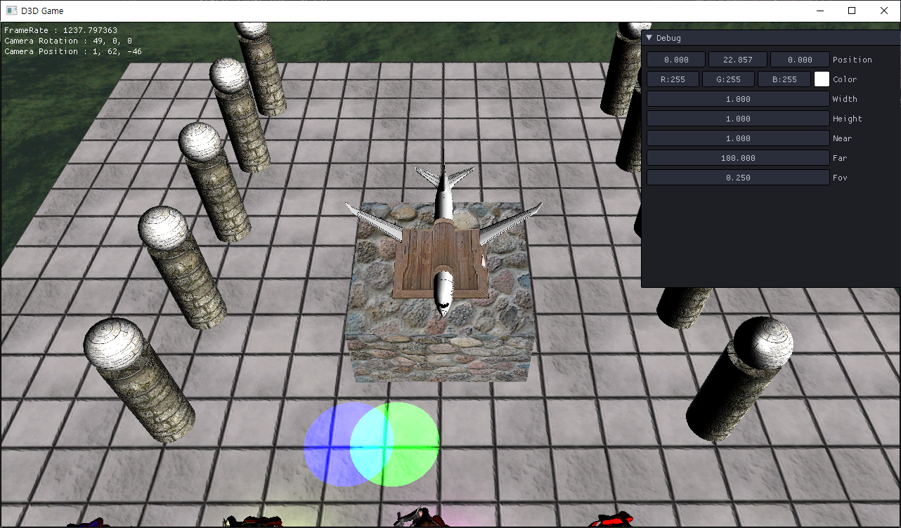
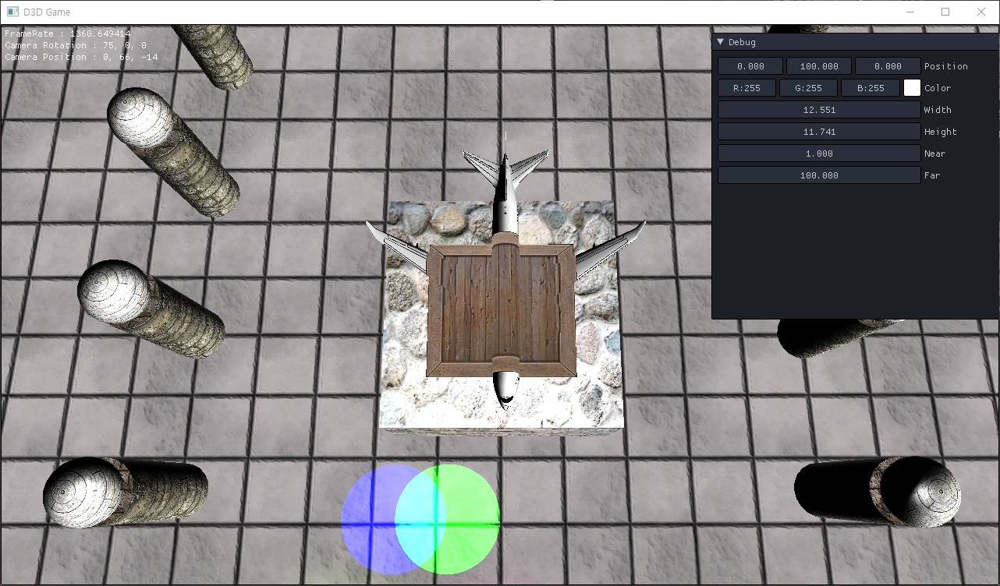

# Projector

## Projector Class

<details>
<summary>Fixity</summary>
<div markdown="1">

```
#pragma once
#include "Camera.h"

class Fixity : public Camera
{
public:
	Fixity();
	~Fixity();

	void Update() override;
	void SetView(Matrix& view) { matView = view; }

private:

};
```

```
#include "Framework.h"
#include "Fixity.h"

Fixity::Fixity()
{
	Rotation();
	Move();
}

Fixity::~Fixity()
{
}

void Fixity::Update()
{

}
```

</div>
</details>

각 프로젝션에 사용될 고정되어있는 카메라다.

<details>
<summary>Projector.h</summary>
<div markdown="1">

```
#pragma once

class Projector
{
public:
	Projector(Shader* shader, wstring mapFile, UINT width, UINT height);
	~Projector();

	void Update();
	void Render();

	Camera* GetCamera() { return (Camera *)camera; }

private:
	struct Desc
	{
		Matrix View;
		Matrix Projection;

		Color Color = D3DXCOLOR(1, 1, 1, 1);
	} desc;

private:
	Shader* shader;

	UINT width, height;

	Fixity* camera;
	Projection* projection;

	Texture* map;
	ID3DX11EffectShaderResourceVariable* sMap;

	ConstantBuffer* buffer;
	ID3DX11EffectConstantBuffer* sBuffer;
};
```

</div>
</details>

<details>
<summary>Projector.cpp</summary>
<div markdown="1">

```
#include "Framework.h"
#include "Projector.h"

Projector::Projector(Shader * shader, wstring mapFile, UINT width, UINT height)
	: shader(shader), width(width), height(height)
{
	camera = new Fixity();

	camera->Position(0, 0, -20.0f);
	projection = new Perspective((float)width, (float)height, 1, 100, Math::PI * 0.25);

	map = new Texture(mapFile);
	buffer = new ConstantBuffer(&desc, sizeof(Desc));


	sMap = shader->AsSRV("ProjectorMap");
	sMap->SetResource(map->SRV());

	sBuffer = shader->AsConstantBuffer("CB_Projector");
}

Projector::~Projector()
{
	SafeDelete(camera);
	SafeDelete(projection);

	SafeDelete(map);
	SafeDelete(buffer);
}

void Projector::Update()
{
	Vector3 position;
	camera->Position(&position);

	ImGui::SliderFloat3("Position", position, -100, 100);
	camera->Position(position);

	ImGui::ColorEdit3("Color", desc.Color);

	//Perspective
	{
		static float width = this->width, height = this->height;
		static float n = 1.0f, f = 100.0f;
		static float fov = 0.25f;
		
		ImGui::SliderFloat("Width", &width, 0, 100);
		ImGui::SliderFloat("Height", &height, 0, 100);
		ImGui::SliderFloat("Near", &n, 0, 200);
		ImGui::SliderFloat("Far", &f, 0, 200);
		ImGui::SliderFloat("Fov", &fov, 0, Math::PI * 2.0f);
		
		((Perspective *)projection)->Set(width, height, n, f, Math::PI * fov);
	}

	camera->GetMatrix(&desc.View);
	projection->GetMatrix(&desc.Projection);
}

void Projector::Render()
{
	buffer->Render();
	sBuffer->SetConstantBuffer(buffer->Buffer());
}
```

</div>
</details>

위에 만든 고정된 카메라를 사용해서 투영오브젝트를 만들어준다.


카메라의 위치 때문에 생각한것과는 많이 다른 결과가 나왔다.



위치를 변경하면 잘 나오지만, 문제가 있다. 카메라의 위치에 따라 크기가 변경된다.

Perspective로 보고있기 때문에 원근감이 있어 변경된다. 이것을 Orthographic으로 변경하면



이제 원하는대로 잘 나온다.

