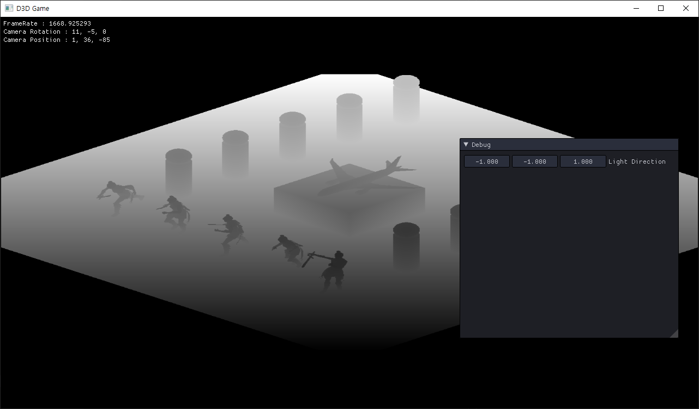
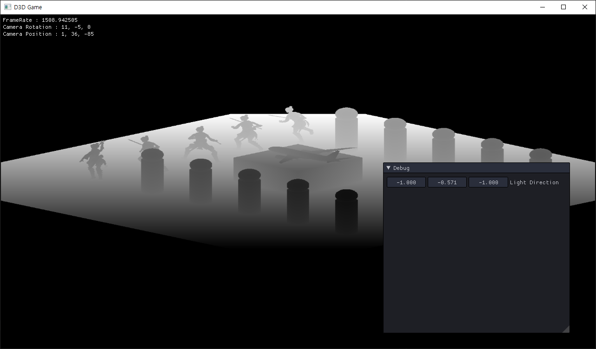

와 마지막 강의~ 어예~

# Shadow
IA - VS - RS - PS - OM

RS에서 RTV와 DSV로 나눠지고, RTV는 PS를 거쳐 OM으로 가고 DSV는 PS를 거치지 않고 OM으로 간다.

RTV에 연결된 텍스쳐에는 렌더링 결과가 들어가고 DSV에 연결된 텍스쳐에는 깊이 정보가 들어간다.

우리가 보는 방향의 View, Projection과
 GlobalLight에서의 View, Projection을 구해준다.

우리가 보는 방향과 Light방향에서 RTV에서 렌더 된 장면을 DSV에는 깊이를 써준다.

여기서 DSV의 값들을 비교해서 그림자를 만들어준다.

두개의 Pass를 사용할 것인데

첫번째 1Pass에서는 깊이를 따고

두번째 2Pass에서는 깊이를 비교하면서 깊이를 그려준다.

일단 깊이값만 확인해보자
 
## Shadow Class

<details>
<summary style="color:green">Shadow.h</summary>
<div markdown="1">

```
#pragma once

class Shadow
{
public:
	Shadow(Shader* shader, Vector3& position, float radius, UINT width = 1024, UINT height = 1024);
	~Shadow();

	void PreRender();

	ID3D11ShaderResourceView* SRV() { return renderTarget->SRV(); }

private:
	void CalcViewProjection();

private:
	// 쉐이더에 넘겨줄 구조체
	struct Desc
	{
		Matrix View;
		Matrix Projection;

		Vector2 MapSize;
		float Bias = -0.0006f;

		UINT Quality = 0;
	}desc;

private:
	Shader* shader;
	// 깊이의 크기
	UINT width, height;

	// 조명이 어떤 지점을 비춰주나
	Vector3 position;
	// 조명 구역
	float radius;

	// 없어도 괜찮지만, 어떻게 나오는지 확인하기 위해 사용
	RenderTarget* renderTarget;
	DepthStencil* depthStencil;
	Viewport* viewport;

	// 그림자 정보들
	ConstantBuffer* buffer;
	ID3DX11EffectConstantBuffer* sBuffer;
	// 깊이 렌더링 했으면 2Pass에 깊이를 줄 변수
	ID3DX11EffectShaderResourceVariable* sShadowMap;
};
```

</div>
</details>

<details>
<summary style="color:green">Shadow.cpp</summary>
<div markdown="1">

```
#include "Framework.h"
#include "Shadow.h"

Shadow::Shadow(Shader * shader, Vector3 & position, float radius, UINT width, UINT height)
	: shader(shader), position(position), radius(radius), width(width), height(height)
{
	renderTarget = new RenderTarget(width, height);
	depthStencil = new DepthStencil(width, height);
	viewport = new Viewport((float)width, (float)height);

	buffer = new ConstantBuffer(&desc, sizeof(Desc));
	sBuffer = shader->AsConstantBuffer("CB_Shadow");
	sShadowMap = shader->AsSRV("ShadowMap");
}

Shadow::~Shadow()
{
	SafeDelete(renderTarget);
	SafeDelete(depthStencil);
	SafeDelete(viewport);

	SafeDelete(buffer);
}

void Shadow::PreRender()
{
	// 1Pass
	ImGui::SliderFloat3("Light Direction", Context::Get()->Direction(), -1, +1);

	renderTarget->PreRender(depthStencil);
	viewport->RSSetViewport();

	CalcViewProjection();

	buffer->Render();
	sBuffer->SetConstantBuffer(buffer->Buffer());
	
	sShadowMap->SetResource(depthStencil->SRV());
}

void Shadow::CalcViewProjection()
{
	Vector3 up = Vector3(0, 1, 0);
	Vector3 direction = Context::Get()->Direction();
	Vector3 position = direction * radius * -2.0f;

	D3DXMatrixLookAtLH(&desc.View, &position, &this->position, &up);


	Vector3 origin;
	D3DXVec3TransformCoord(&origin, &this->position, &desc.View);

	float l = origin.x - radius;
	float b = origin.y - radius;
	float n = origin.z - radius;

	float r = origin.x + radius;
	float t = origin.y + radius;
	float f = origin.z + radius;

	D3DXMatrixOrthoLH(&desc.Projection, r - l, t - b, n, f);
}
```

</div>
</details>

## Shader

<details>
<summary style="color:green">00_Render.fx</summary>
<div markdown="1">

```
#define VS_DEPTH_GENERATE \
output.Position = WorldPosition(input.Position); \
output.Position = mul(output.Position, ShadowView); \
output.Position = mul(output.Position, ShadowProjection); \
\
output.sPosition = output.Position;

float4 PS_Depth(DepthOutput input) : SV_Target
{
    float depth = input.Position.z / input.Position.w;
    
    return float4(depth, depth, depth, 1.0f);
}

DepthOutput VS_Depth_Mesh(VertexMesh input)
{
    DepthOutput output;
    
    SetMeshWorld(World, input);
    VS_DEPTH_GENERATE
    
    return output;
}

DepthOutput VS_Depth_Model(VertexModel input)
{
    DepthOutput output;
    
    SetModelWorld(World, input);
    VS_DEPTH_GENERATE
     
    return output;
}

DepthOutput VS_Depth_Animation(VertexModel input)
{
    DepthOutput output;
    
    if (BlendFrames[input.InstanceID].Mode == 0)
    {
        SetTweenWorld(World, input);
    }
    else
    {
        SetBlendWorld(World, input);
    }
        
    VS_DEPTH_GENERATE
    
    return output;
}

```

</div>
</details>

Shader에 깊이를 계산할 수 있도록 추가해준다.





각 부분에서 바라볼 때의 깊이값이다.
