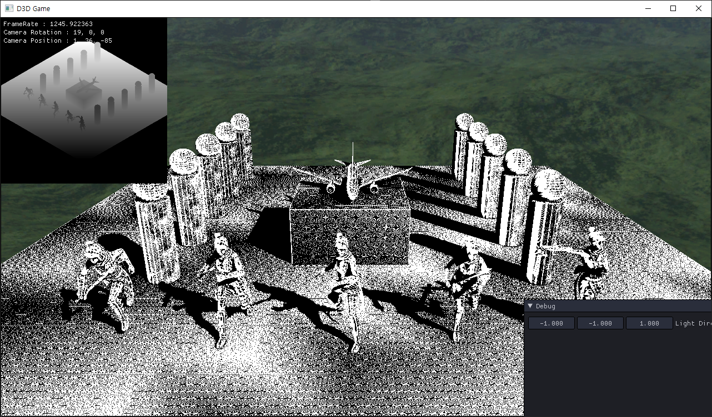
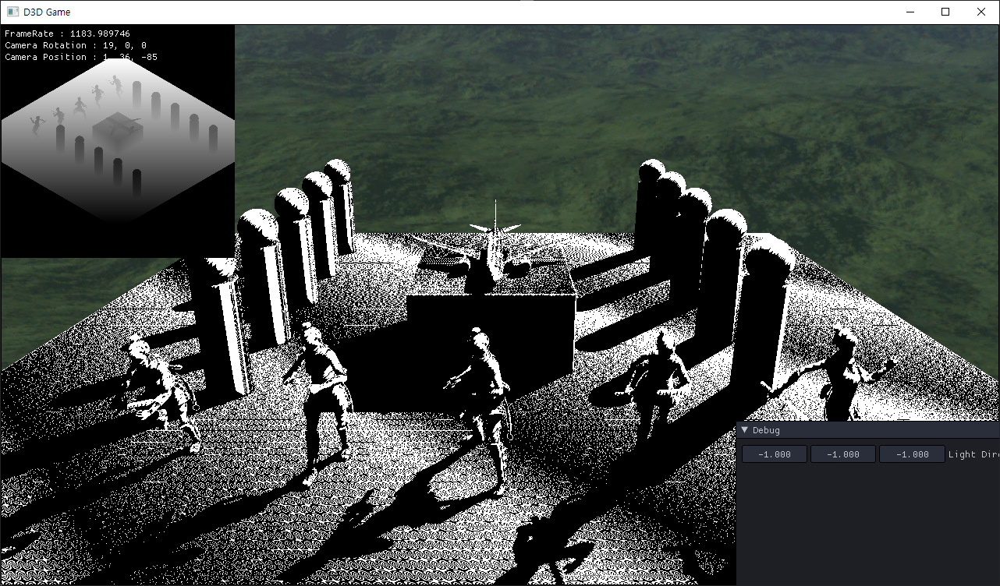

# Shadow
이 전에는 Pass1을 계산했고 이번에는 Pass2를 계산하자

## Shader
<details>
<summary>00_Global.fx</summary>
<div markdown="1">

```
struct MeshOutput
{
    float4 Position : SV_Position0; //Rasterizing Position
    float3 oPosition : Position1; //Original Position
    float3 wPosition : Position2; //World Position
    float4 wvpPosition : Position3; // WVP
    float4 wvpPosition_Sub : Position4; // WVP
    float4 sPosition : Position5; // Light WVP
    
    float4 Color : Color;
    float3 Normal : Normal;
    float3 Tangent : Tangent;
    float2 Uv : Uv;
};
```

</div>
</details>

빛의 WVP를 계산하기 위해 MeshOutput에 sPosition을 추가해주고

<details>
<summary style="color:green">00_Render.fx</summary>
<div markdown="1">

```
#define VS_GENERATE \
output.oPosition = input.Position.xyz; \
\
output.Position = WorldPosition(input.Position); \
output.wPosition = output.Position.xyz; \
output.Position = ViewProjection(output.Position); \
output.wvpPosition = output.Position; \
output.wvpPosition_Sub = output.Position; \
\
output.sPosition = WorldPosition(input.Position);\
output.sPosition = mul(output.sPosition, ShadowView);\
output.sPosition = mul(output.sPosition, ShadowProjection);\
\
output.Normal = WorldNormal(input.Normal); \
output.Tangent = WorldTangent(input.Tangent);\
\
output.Uv = input.Uv; \
output.Color = input.Color;
```

</div>
</details>

Render 실행 매크로에 
```
output.sPosition = WorldPosition(input.Position);\
output.sPosition = mul(output.sPosition, ShadowView);\
output.sPosition = mul(output.sPosition, ShadowProjection);\
```
이 계산을 추가 해주자

<details>
<summary style="color:green">113_Shadow.fx</summary>
<div markdown="1">

```
float4 PS(MeshOutput input) : SV_Target
{
    float4 color = float4(1, 1, 1, 1);
    
    float4 position = input.sPosition;
    
    position.xyz /= position.w;
    
    position.x = position.x * 0.5f + 0.5f;
    position.y = -position.y * 0.5f + 0.5f;
    
    float depth = 0;
    float z = position.z;
    float factor = 0;
    
    depth = ShadowMap.Sample(LinearSampler, position.xy).r;
    factor = (float) (depth >= z);
    
    return color * factor;
}
```

</div>
</details>

그리고 X,Y축에 빛의 방향에 따라서 z축을 계산해주자

그리고 이 상태로 실행을 시켜주면





이렇게 그림자가 잘 나오지만, 뭔가 이상한 효과까지 나왔다.

이는 Pass1과 Pass2의 Z Fighting이 나타나서 이런 문제가 나온다.

다음에는 Z Fighting을 해결해보자