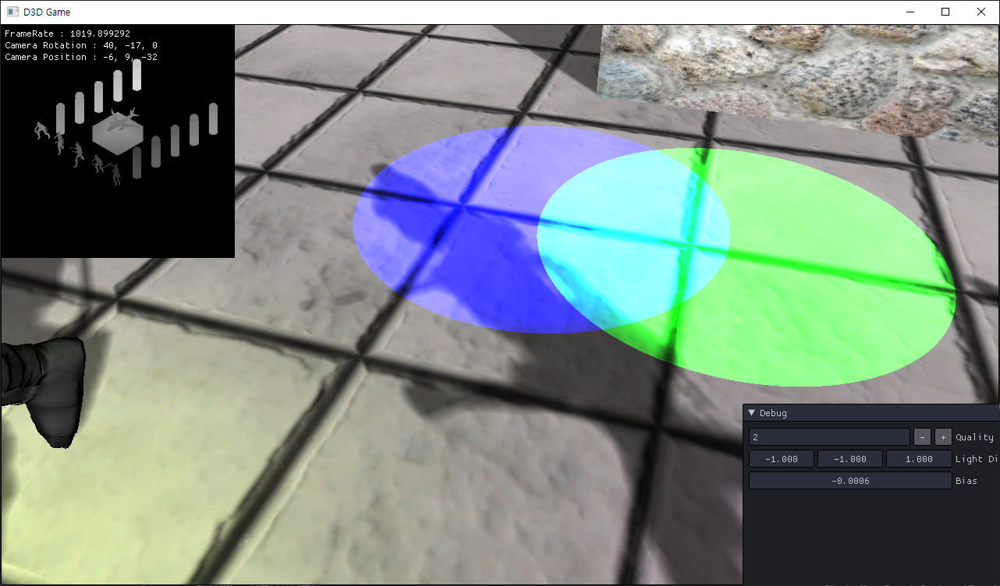

# Shadow
이 전에 생겼던 Z Fighting문제를 해결해보자

앞에 Pass1을 뒤집으면 해결이 된다.

## Shader

<details>
<summary style="color:green">113_Shader</summary>
<div markdown="1">

```
technique11 T0
{ 
// 1Pass Depth Rendering
    //P_VP(P0, VS_Depth_Mesh, PS_Depth)
    //P_VP(P1, VS_Depth_Model, PS_Depth)
    //P_VP(P2, VS_Depth_Animation, PS_Depth)

    //// 1Pass Depth Rendering
    P_RS_VP(P0, FrontCounterClockwise_True, VS_Depth_Mesh, PS_Depth)
    P_RS_VP(P1, FrontCounterClockwise_True, VS_Depth_Model, PS_Depth)
    P_RS_VP(P2, FrontCounterClockwise_True, VS_Depth_Animation, PS_Depth)

    P_VP(P3, VS_Mesh, PS)
    P_VP(P4, VS_Model, PS)
    P_VP(P5, VS_Animation, PS)
}
```

</div>
</details>


해결!

이제 여기에 색만 더해주면


자연스럽다.

이제 좀더 자연스럽게 만들어 보자

빛을 보면 빛과 멀면 멀수록 그림자의 색이 연해지는것을 볼 수 있다.

쉐이더 마지막에
```
factor = saturate(factor + depth);
```
이것을 해주고 곱해주면


이제 멀면 멀수록 더 연하게 만들어진다.

하지만 아직 문제가 있다.


그림자가 픽셀 단위로 보인다.

### 해결책
PCF를 사용해서 해결할 수 있다.

- PCF
    - Percentage
    - Closer
    - Filtering

깊이 비교를 하드웨어에게 맡기는 방법이다.

VSM도 있지만 다음에 공부할 기회가 생기면 다뤄보자

### Shadow Class


```
ID3D11SamplerState* pcfSampler;
ID3DX11EffectSamplerVariable* sPcfSampler;
```

```
// Create Sampler State
{
	D3D11_SAMPLER_DESC desc;
	ZeroMemory(&desc, sizeof(D3D11_SAMPLER_DESC));
	desc.Filter = D3D11_FILTER_COMPARISON_MIN_MAG_MIP_LINEAR;
	desc.ComparisonFunc = D3D11_COMPARISON_LESS_EQUAL;
	desc.AddressU = D3D11_TEXTURE_ADDRESS_CLAMP;
	desc.AddressV = D3D11_TEXTURE_ADDRESS_CLAMP;
	desc.AddressW = D3D11_TEXTURE_ADDRESS_CLAMP;
	desc.MaxAnisotropy = 1;
	desc.MaxLOD = FLT_MAX;
		
	Check(D3D::GetDevice()->CreateSamplerState(&desc, &pcfSampler));
	sPcfSampler = shader->AsSampler("ShadowSampler");
}
```
SamplerState를 생성해주고 만들어준다.

중간에 보이는 Comaprison은 값들을 비교할 때 사용해야 한다.


### Shader
```
else if(ShadowQuality == 1) // PCF
{
    depth = position.z;
    factor = ShadowMap.SampleCmpLevelZero(ShadowSampler, position.xy, depth).r;
}
```

이렇게 만들면


전보다는 괜찮아 졌지만 아직 애매하다.


이 다음에는 주변의 픽셀들의 색의 평균을 넣어주면

```
else if (ShadowQuality == 2) //PCF + Blur
{
    depth = position.z;
    
    float2 size = 1.0f / ShadowMapSize;
    float2 offsets[] =
    {
        float2(-size.x, -size.y), float2(0.0f, -size.y), float2(+size.x, -size.y),
        float2(-size.x, 0.0f), float2(0.0f, 0.0f), float2(+size.x, 0.0f),
        float2(-size.x, +size.y), float2(0.0f, +size.y), float2(+size.x, +size.y),
    };
    
    
    float2 uv = 0;
    float sum = 0;
    
    [unroll(9)]
    for (int i = 0; i < 9; i++)
    {
        uv = position.xy + offsets[i];
        sum += ShadowMap.SampleCmpLevelZero(ShadowSampler, uv, depth).r;
    }
    
    factor = sum / 9.0f;
}
```



훨씬 자연스럽다

후... 끝났다...

이제 DriectX공부는 마친다.

다음에는 Unreal 게임을 하나 제작해 보자