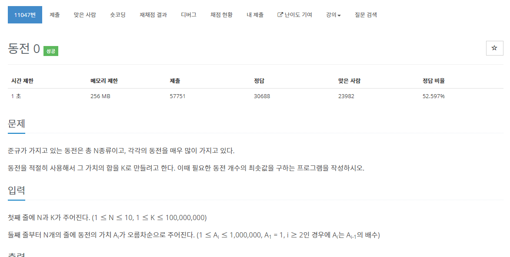

[문제](https://www.acmicpc.net/problem/11047)

이 전에 풀었던 문제와 비슷하다. 하지만 이번에는 원하는 동전의 갯수만큼 계산해준다.

```
#include <stdio.h>
#include <iostream>

#define MAX 10

using namespace std;

int main()
{
	int N, K;
	int coins[MAX];

	cin >> N >> K;

	for (int i = 0; i < N; i++)
	{
		cin >> coins[i];
	}

	int coinsIndex = N - 1;
	int count = 0;

	while (K > 0)
	{
		int temp = K / coins[coinsIndex];

		K -= coins[coinsIndex] * temp;
		count += temp;

		coinsIndex--;
	}
	printf("%d\n", count);
}
```