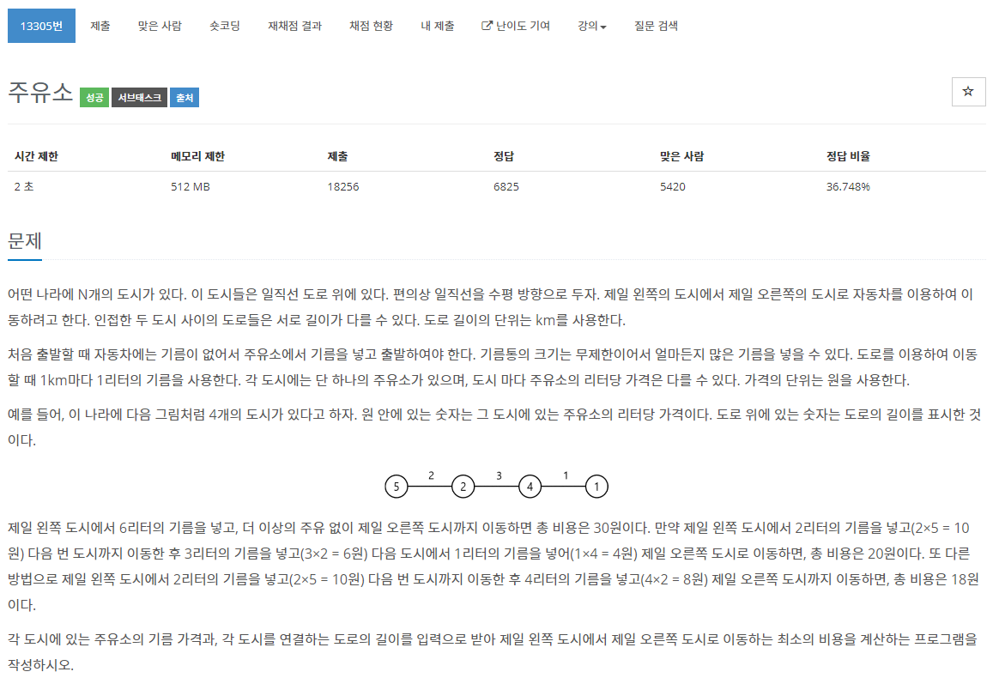

[문제](https://www.acmicpc.net/problem/13305)

이번에는 조금 살짝 복잡한 문제이다.

하지만, 조금만 생각해보면 쉽다.

현재까지 지나왔던 도시중에 가장 싼 곳을 골라 다음 도시까지의 기름값을 계산해주면 된다.

```
#include <stdio.h>
#include <iostream>

#include <vector>

#define MAX 1000000001

using namespace std;

int main()
{
	int N;
	cin >> N;

	vector<long long> cost(N);
	vector<long long> length(N - 1);

	for (int i = 0; i < length.size(); i++)
	{
		cin >> length[i];
	}

	for (int i = 0; i < cost.size(); i++)
	{
		cin >> cost[i];
	}

	long long amount = 0;
	long long min = MAX;

	for (int i = 0; i < N-1; i++)
	{
		if (min > cost[i])
		{
			min = cost[i];
		}

		amount += length[i] * min;
	}
	
	printf("%d\n", amount);
}
```