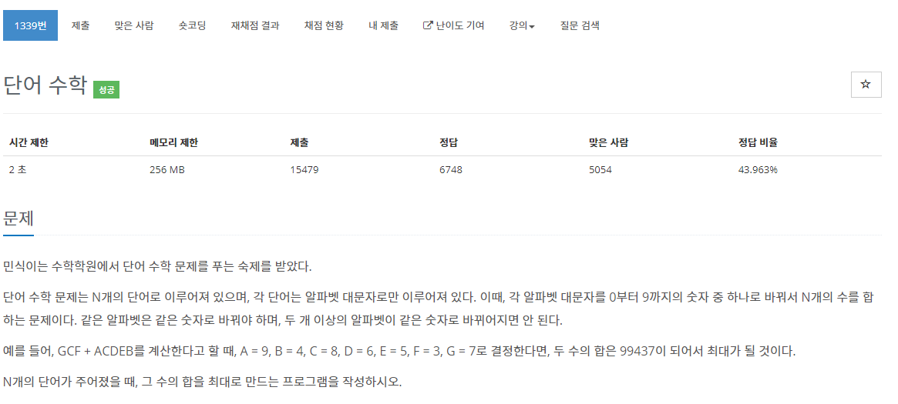

[문제](https://www.acmicpc.net/problem/1339)

문제 자체는 간단한데 좀 생각해볼 것들이 많은 문제이다.

일단 메모리 제한을 보면 메모리는 매우 넉넉하게 준다.

그리고 A~Z까지 10개를 사용했을때 나오는 값들을 생각해야 하는데

일단 나는 이 문제를 가중치를 이용해서 풀었다.

가장 높은 자릿수에 있는 알파벳마다 많은 가중치를 더해주고 가장 높은 가중치를 갖고있는 알파벳부터 9를 부여해서 구해줬다.

```
#include <string>
#include <vector>
#include <iostream>
#include <cmath>
#include <algorithm>

#include <stdio.h>

using namespace std;

struct Alphabet
{
	char a;
	int weight;
};

bool Compare(Alphabet& a, Alphabet& b)
{
	return a.weight > b.weight;
}

int main()
{
	int N;
	cin >> N;

	vector<string> words(N);
	for (int i = 0; i < N; i++)
	{
		cin >> words[i];
	}

	Alphabet alphabets[26];
	for (int i = 0; i < 26; i++)
	{
		char a = i + 'A';
		alphabets[i] = { a  , 0 };
	}

	for (int i = 0; i < words.size(); i++)
	{
		for (int j = 0; j < words[i].size(); j++)
		{
			int weight = pow(10, (words[i].size() - j - 1));
			alphabets[words[i][j] - 'A'].weight += weight;
		}
	}

	sort(alphabets, alphabets + 26, Compare);

	int temp = 0;
	for (int i = 0; i < 10; i++)
	{
		temp += alphabets[i].weight * (10 - i - 1);
	}
	printf("%d\n", temp);
}
```

일단 구조체를 사용해서 만들어준 뒤, 10의 제곱수 만큼 가중치를 각 알파벳에 더해준다.

그렇게 하고 그 가중치만큼 가장 높은 수를 곱해서 더해주면 가장 큰 값이 만들어진다.