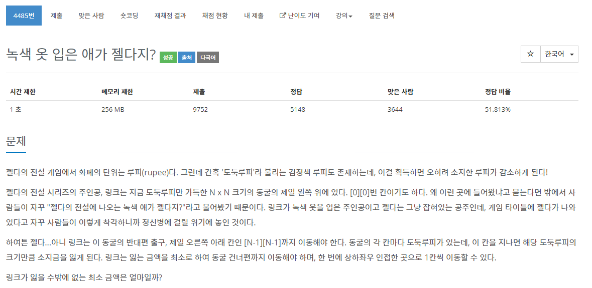

[문제](https://www.acmicpc.net/problem/4458)


(젤다 아니다 링크다 ㅋㅋㅋㅋ)

처음에는 BFS, DFS 그래프 문제인 줄 알고 풀었는데 최단 경로의 비용을 구하는 것이기 때문에 다익스트라 알고리즘이다.

(그런데 BFS로 풀어도 풀린다;;)

일단 BFS로 풀면

<details>
<summary>BFS</summary>
<div markdown="1">

```
#include <stdio.h>

#include <iostream>
#include <vector>
#include <queue>

#define MAX 125
#define MONEY_MAX 99999999

using namespace std;

struct Vector2
{
	int x, y;
};

Vector2 operator+(Vector2 position1, Vector2 position2)
{
	return { position1.x + position2.x, position1.y + position2.y };
}

Vector2 dir[4] = { {1,0}, {0,1}, {-1,0}, {0,-1} };

int map[MAX][MAX];
int moneyCount[MAX][MAX];

int BFS(Vector2 startPosition, const int& N)
{
	fill(&moneyCount[0][0], &moneyCount[MAX - 1][MAX], MONEY_MAX);

	queue<Vector2> q;
	q.push(startPosition);

	moneyCount[startPosition.y][startPosition.x] = map[startPosition.y][startPosition.x];

	while (!q.empty())
	{
		Vector2 currentPosition = q.front();
		q.pop();

		for (int i = 0; i < 4; i++)
		{
			Vector2 movePosition = currentPosition + dir[i];

			if (movePosition.x < 0 || movePosition.x >= N || movePosition.y < 0 || movePosition.y >= N) { continue; }

			int count = moneyCount[currentPosition.y][currentPosition.x] + map[movePosition.y][movePosition.x];

			if (count < moneyCount[movePosition.y][movePosition.x])
			{
				moneyCount[movePosition.y][movePosition.x] = count;
				q.push(movePosition);
			}
		}
	}

	return moneyCount[N - 1][N - 1];
}


int main()
{
	int N = 9999;
	vector<int> answers;
	while (N != 0)
	{
		cin >> N;

		for (int i = 0; i < N; i++)
		{
			for (int j = 0; j < N; j++)
			{
				cin >> map[i][j];
			}
		}

		answers.push_back(BFS({ 0,0 }, N));
	}

	for (int i = 0; i < answers.size()-1; i++)
	{
		printf("Problem %d: %d\n", i+1, answers[i]);
	}
	return 0;
}
```

</div>
</details>

풀리긴 풀리는데 시간이 살짝 많이 걸린다.

다익스트라 알고리즘은 현재 비용과 다음 비용을 비교해서 우선순위 큐에 넣고 가장 비용이 작은 값만 비교하는 방법이다.

<details>
<summary>Dijkstra</summary>
<div markdown="1">

```
#include <stdio.h>

#include <iostream>
#include <queue>
#include <vector>

#define MAX 125
#define INF 99999999

using namespace std;

struct Vector2
{
	int value;
	int x, y;
};

struct compare
{
	bool operator()(const Vector2& position1, const Vector2& position2)
	{
		return position1.value > position2.value;
	}
};

Vector2 operator+(const Vector2& position1, const Vector2& position2)
{
	return { position1.x + position2.x, position1.y + position2.y };
}

Vector2 dir[4] = { {0,1,0}, {0,0,1}, {0,-1,0}, {0,0,-1} };

int map[MAX][MAX];
int cost[MAX][MAX];

int EXIT(Vector2 startPosition, int& N)
{
	priority_queue<Vector2, vector<Vector2>, compare> pq;
	fill(&cost[0][0], &cost[MAX - 1][MAX], INF);
	cost[startPosition.y][startPosition.x] = map[startPosition.y][startPosition.x];
	pq.push(startPosition);
	while (!pq.empty())
	{
		Vector2 currentPosition = pq.top();
		pq.pop();

		for (int i = 0; i < 4; i++)
		{
			int moveX = currentPosition.x + dir[i].x;
			int moveY = currentPosition.y + dir[i].y;
			Vector2 movePosition = { currentPosition.value + map[moveY][moveX], moveX, moveY };

			if (movePosition.x < 0 || movePosition.x >= N || movePosition.y < 0 || movePosition.y >= N) { continue; }

			if (movePosition.value < cost[movePosition.y][movePosition.x])
			{
				cost[movePosition.y][movePosition.x] = movePosition.value;
				pq.push(movePosition);
			}
		}
	}
	return cost[N - 1][N - 1];
}

int main()
{
	int N = 9999;
	vector<int> answers;
	while (N != 0)
	{
		cin >> N;

		for (int i = 0; i < N; i++)
		{
			for (int j = 0; j < N; j++)
			{
				cin >> map[i][j];
			}
		}

		answers.push_back(EXIT({map[0][0], 0,0 }, N));
	}

	for (int i = 0; i < answers.size() - 1; i++)
	{
		printf("Problem %d: %d\n", i + 1, answers[i]);
	}
	return 0;
}
```

</div>
</details>


확실히 시간이 줄어든다.