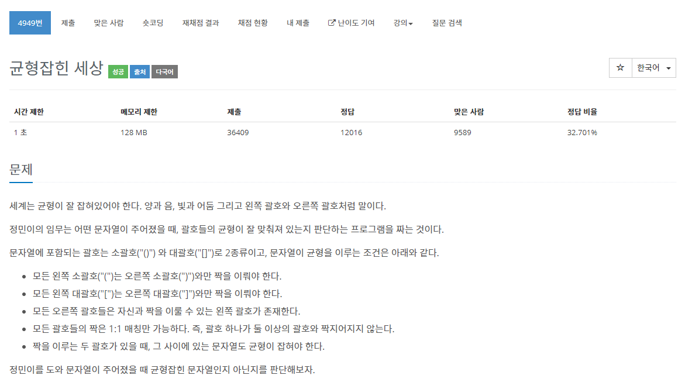

[문제](https://www.acmicpc.net/problem/4949)

하나 딱 하나때문에 좀 오래걸렸다.

문자열을 입력받고 여는 괄호를 스텍에 저장하고 닫는 괄호랑 비교한뒤,

마지막에 stack의 갯수에 따라 정해주면 된다.

```
#include <stdio.h>

#include <iostream>
#include <string>
#include <stack>
#include <vector>

using namespace std;

bool IsComplete(const string& sentence)
{
	stack<char> s;

	for (int i = 0; i < sentence.length(); i++)
	{
		if (sentence[i] == '(' || sentence[i] == '[')
		{
			s.push(sentence[i]);
		}

		else if (sentence[i] == ')')
		{
			if (s.empty() == true)
			{
				return false;
			}
			char c = s.top();
			s.pop();

			if (c != '(')
			{
				return false;
			}
		}
		else if (sentence[i] == ']')
		{
			if (s.empty() == true)
			{
				return false;
			}

			char c = s.top();
			s.pop();

			if (c != '[')
			{
				return false;
			}
		}
	}

	if (s.empty())
	{
		return true;
	}
	else
	{
		return false;
	}
}


int main()
{
	vector<bool> answers;
	while (true)
	{
		cin.clear();
		string s;
		getline(cin, s);

		if (s == ".") { break; }

		answers.push_back(IsComplete(s));
	}

	for (int i = 0; i < answers.size(); i++)
	{
		if (answers[i] == true)
		{
			printf("yes\n");
		}
		else
		{
			printf("no\n");
		}
	}
}
```

마지막 스텍의 갯수를 생각 안해서 좀 오래 걸렸다 ㅋㅋ