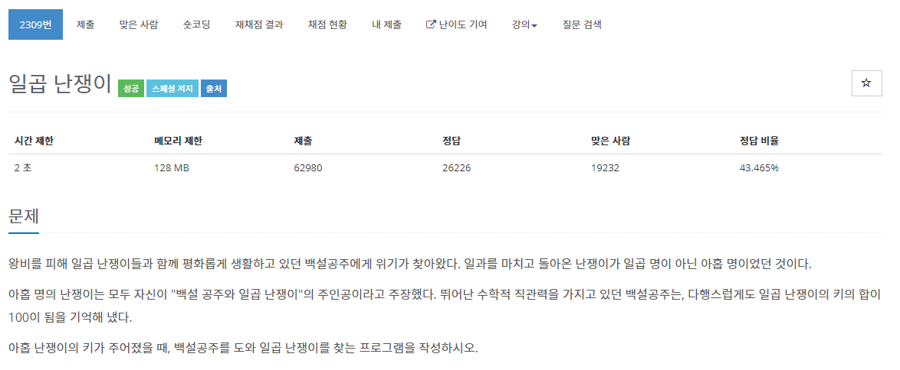

[문제](https://www.acmicpc.net/problem/2309)

정말 간단한 문제다.

전체에서 100을 뺀 수를 숫자 2개를 이용해서 만들 수 있는 숫자만 빼면 된다.

```
#include <stdio.h>

#include <iostream>
#include <vector>
#include <algorithm>

using namespace std;

void GetAnswer(vector<int>& v, const int& amount)
{
	sort(v.begin(), v.end());
	int temp = 0;
	for (int i = 0; i < 9; i++)
	{
		for (int j = i + 1; j < 9; j++)
		{
			temp = v[i] + v[j];
			if (temp == amount)
			{
				v.erase(v.begin() + i);
				v.erase(v.begin() + j - 1);
				return;
			}
		}
	}
}

int main()
{
	vector<int> v(9);

	int amount = 0;
	for (int i = 0; i < 9; i++)
	{
		cin >> v[i];
		amount += v[i];
	}
	amount -= 100;
	GetAnswer(v, amount);
	for (int i = 0; i < 7; i++)
	{
		printf("%d\n", v[i]);
	}
}
```
