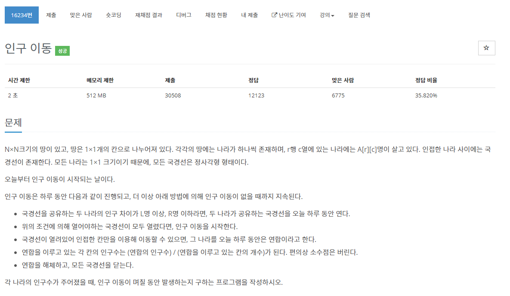

[문제](https://www.acmicpc.net/problem/16234)

그래프 탐색 문제중에 섬의 갯수를 구하는 문제가 있는데 이 문제와 비슷하면서 좀 더 응용한 문제이다.

일단 탐색을 이용해서 범위 내에 있는 좌표들을 갖고온다.

그 후, 평균을 낸 값을 각 좌표값에 넣어준다.

한번도 안나올 때 까지 이 과정을 반복해준다.

```
#include <stdio.h>

#include <iostream>
#include <vector>
#include <queue>
#include <cmath>

#define MAX 51

using namespace std;

struct Vector2
{
	int x, y;
};

Vector2 operator +(const Vector2& position1, const Vector2& position2)
{
	return { position1.x + position2.x, position1.y + position2.y };
}

Vector2 dir[4] = { {1,0},{0,1},{-1,0},{0,-1} };

int map[MAX][MAX];
bool bIsVisited[MAX][MAX];

int N, L, R;

vector<Vector2> BFS(Vector2 startPosition)
{
	queue<Vector2> q;
	q.push(startPosition);
	vector<Vector2> v;
	while (!q.empty())
	{
		Vector2 currentPosition = q.front();
		q.pop();

		if (bIsVisited[currentPosition.y][currentPosition.x] == true) { continue; }
		bIsVisited[currentPosition.y][currentPosition.x] = true;
		v.push_back(currentPosition);

		for (int i = 0; i < 4; i++)
		{
			Vector2 movePosition = currentPosition + dir[i];

			if (movePosition.x < 0 || movePosition.x >= N || movePosition.y < 0 || movePosition.y >= N) { continue; }

			int difference = abs(map[movePosition.y][movePosition.x] - map[currentPosition.y][currentPosition.x]);

			if (difference < L || difference > R) { continue; }

			q.push(movePosition);
		}
	}
	return v;
}

int GetAnswer()
{
	int answer = -1;
	bool bIsThere = true;
	while (bIsThere == true)
	{
		bIsThere = false;
		for (int i = 0; i < N; i++)
		{
			for (int j = 0; j < N; j++)
			{
				if (bIsVisited[i][j] == true) { continue; }

				vector<Vector2> temp = BFS({ j,i });

				int amount = 0;
				int vectorSize = temp.size();

				if (vectorSize > 1)
				{
					bIsThere = true;

					for (int k = 0; k < vectorSize; k++)
					{
						amount += map[temp[k].y][temp[k].x];
					}
					amount /= temp.size();

					for (int k = 0; k < vectorSize; k++)
					{
						map[temp[k].y][temp[k].x] = amount;
					}
				}
			}
		}
		answer++;
		fill(&bIsVisited[0][0], &bIsVisited[N - 1][N - 1], false);
	}
	return answer;
}

int main()
{
	cin >> N >> L >> R;

	for (int i = 0; i < N; i++)
	{
		for (int j = 0; j < N; j++)
		{
			cin >> map[i][j];
		}
	}

	int answer = GetAnswer();
	printf("%d\n", answer);
}
```

조금 헷갈렸던 문제이다.