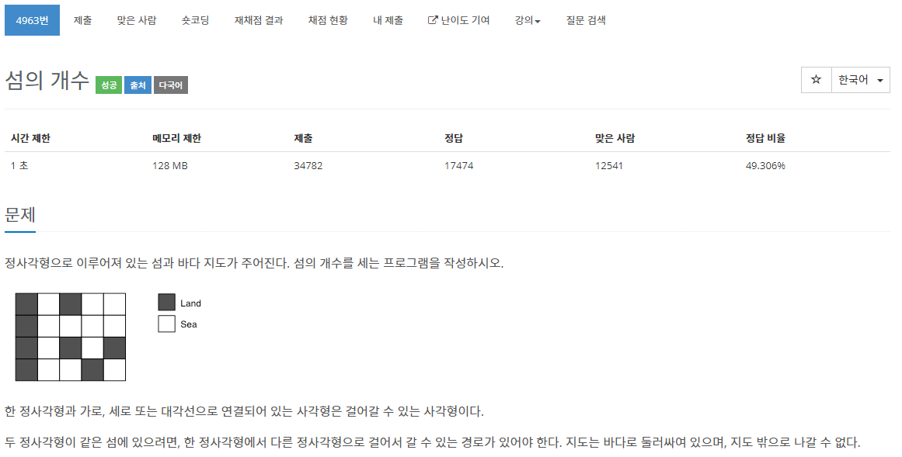

[문제](https://www.acmicpc.net/problem/4963)

섬의 갯수를 구하는 문제이다.

위 아래 양 옆 대각선에 있는 타일을 비교해서 계속해서 DFS 아니면 BFS 둘 중 하나로 찾으면 된다.


```
#include <stdio.h>

#include <iostream>
#include <vector>

#define MAX 51

using namespace std;

struct Vector2
{
	int x, y;
};

Vector2 operator+(const Vector2& v1, const Vector2& v2)
{
	return { v1.x + v2.x , v1.y + v2.y };
}

Vector2 dir[8] = { {1,0}, {0,1}, {-1,0}, {0,-1}, {1,1}, {1,-1},{-1,1},{-1,-1} };

int map[MAX][MAX];
bool bIsVisited[MAX][MAX];

void DFS(const Vector2& currentPosition, const int& H, const int& W)
{
	if (map[currentPosition.y][currentPosition.x] == 0) { return; }
	if (bIsVisited[currentPosition.y][currentPosition.x] == true) { return; }

	bIsVisited[currentPosition.y][currentPosition.x] = true;

	for (int i = 0; i < 8; i++)
	{
		Vector2 movePosition = currentPosition + dir[i];

		if (movePosition.x < 0 || movePosition.x >= W || movePosition.y < 0 || movePosition.y >= H) { continue; }

		DFS(movePosition, H, W);
	}
}

int GetIslandCount(const int& H, const int& W)
{
	int islandCount = 0;
	for (int i = 0; i < H; i++)
	{
		for (int j = 0; j < W; j++)
		{
			if (bIsVisited[i][j] == false && map[i][j] == 1)
			{
				DFS({ j,i }, H, W);
				islandCount++;
			}
		}
	}
	return islandCount;
}

int main(void)
{
	int H = 1, W = 1;
	vector<int> results;
	while (H != 0 && W != 0)
	{
		cin >> W >> H;

		for (int i = 0; i < H; i++)
		{
			for (int j = 0; j < W; j++)
			{
				cin >> map[i][j];
			}
		}

		results.push_back((GetIslandCount(H, W)));

		fill(&bIsVisited[0][0], &bIsVisited[H][W], false);
	}

	for (int i = 0; i < results.size() - 1; i++)
	{
		printf("%d\n", results[i]);
	}
}
```
간단히 말해서 탐색은 그냥 방문했는지만 체크한 뒤, 섬의 갯수를 구한다.