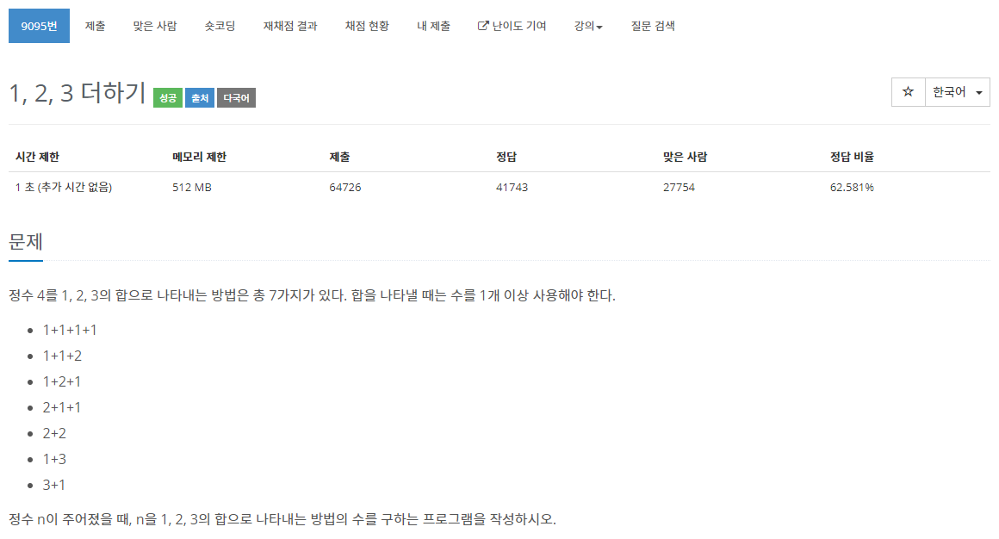

[문제](https://www.acmicpc.net/problem/9095)

다이나믹 프로그래밍!

간만에 하는 다이나믹 프로그래밍이므로 좀 쉬운 문제로 골랐다.

문제를 보면 1,2,3으로 더했을때 갯수를 구하는 문제이다.

1,2,3으로만 생각하니 뒤에서 3개의 값을 더하면 원하는 갯수의 값이 나온다.

4를 만드는 가짓수를 구하고 싶으면
위에 본문에 나와있는 대로 구하면 된다.

이 중에 1을 만드는 방법은 1

2를 만드는 방법은 
- 1+1
- 2

3을 만드는 방법은
- 1+1+1
- 1+2
- 2+1
- 3
이렇게 가짓수가 나온다.

그리고 4를 표현하는 방법은
- 1 + 3을 만드는 방법의 갯수
- 2 + 2를 만드는 방법의 갯수
- 3 + 1을 만드는 방법의 갯수

이렇게 해서
4 + 2 + 1의 가짓수가 나온다.

```
#include <stdio.h>

#include <iostream>

int main()
{
	int* question;
	int N;
	std::cin >> N;

	question = new int[N];

	for (int i = 0; i < N; i++)
	{
		std::cin >> question[i];
	}

	int* results = new int[10];
	results[0] = 1;
	results[1] = 2;
	results[2] = 4;

	for (int i = 3; i < 10; i++)
	{
		results[i] = results[i - 1] + results[i - 2] + results[i - 3];
	}

	for (int i = 0; i < N; i++)
	{
		printf("%d\n", results[question[i] - 1]);
	}

	delete[] question;
	delete[] results;
}
```