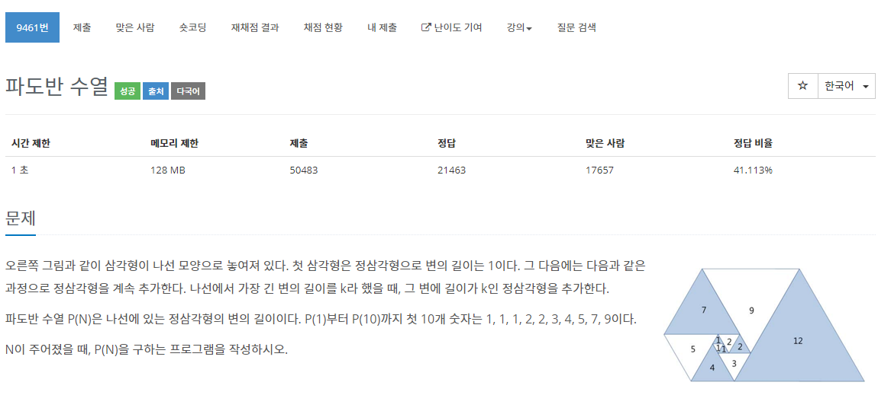

[문제](https://www.acmicpc.net/problem/9461)

삼각형을 계속해서 붙여준다.

6번째 삼각형 부터 보게 되면 이 전, 전에 만든 삼각형의 크기와 이전, 전, 전에 만들었던 삼각형의 크기를 더한 값을 갖게 된다.

i번째 크기는 
- i-2 번째 크기 + i-3번째 크기

이렇게 나오게 된다.

```
#include <stdio.h>
#include <iostream>

using namespace std;

typedef unsigned long long ULL;

int main()
{
	int* question;
	ULL* results;
	ULL temp[5] = {1,1,1,2,2};
	int T;

	cin >> T;
	question = new int[T];

	int max = 0;
	for (int i = 0; i < T; i++)
	{
		cin >> question[i];
		if (question[i] > max)
		{
			max = question[i];
		}
	}

	results = new ULL[max];
	
	for (int i = 0; i < max; i++)
	{
		if (i < 5)
		{
			results[i] = temp[i];
		}

		else
		{
			results[i] = results[i - 1] + results[i - 5];
		}
	}

	for (int i = 0; i < T; i++)
	{
		cout << results[question[i] - 1] << "\n";
	}

	delete[] temp;
	delete[] results;
	delete[] question;
}
```