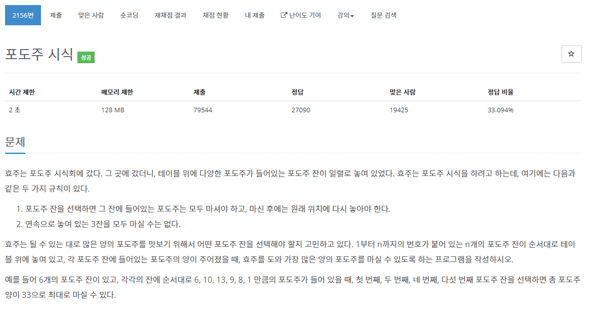

[문제](https://www.acmicpc.net/problem/2156)

와... 역대급으로 나의 머리를 아프게 했던 문제이다.

자 그럼 차근차근 문제를 보자

연속 3개를 먹을 수 없다.

이렇게 되면 처음부터 먹었을때 어떤 방법으로 먹었을 경우 가장 큰 것인지 알아야 한다.

총 세가지의 경우가 나온다.
- 1개를 먹고 건너 뛰고 이전 포도주와 현재 포도주를 먹을 경우
- 이 전에 포도주를 먹고 현재 포도주를 건너 뛴 경우
- 이 2개 전에 먹고 하나를 건너 뛰고 현재 포도주를 먹을 경우

무조건 2개를 건너 뛰게 되면 최대값이 나올 수 없게 된다.

위에 세가지의 경우의 수 중, 가장 큰 값을 고르면 된다.
 이렇게 하면 가장 많이 먹은 크기를 알 수 있다.

```
#include <stdio.h>
#include <iostream>

const int GetMax(int* values)
{
	int max = 0;
	for (int i = 0; i < 3; i++)
	{
		if (values[i] > max)
		{
			max = values[i];
		}
	}
	return max;
}

int main()
{
	int N;
	std::cin >> N;

	int* wines = new int[N + 1];
	wines[0] = 0;
	for (int i = 1; i < N + 1; i++)
	{
		std::cin >> wines[i];
	}

	int* results = new int[N + 1];
	results[0] = 0;
	results[1] = wines[1];
	results[2] = wines[1] + wines[2];

	for (int i = 3; i < N + 1; i++)
	{
		int* num = new int[3];
		num[0] = results[i - 3] + wines[i - 1] + wines[i];
		num[1] = results[i - 1];
		num[2] = results[i - 2] + wines[i];
		results[i] = GetMax(num);
		delete[] num;
	}

	printf("%d\n", results[N]);

	delete[] results;
	delete[] wines;
}
```

와...씨... 어렵다.
