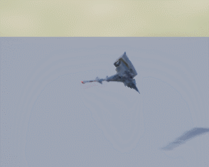

# AnimationMontage
이제 이 전에 만들었던 AnimNotify들을 활용해서 실행시켜주자

이 무기를

이런 동작에 잘 넣어보자

(마지막은 AtkEndNotify다)
이런 식으로 넣어서 각 무기의 공격마다 넣게 되면 애니메이션이 저 프레임을 지날 때 마다 저 노티파이들을 싱행시켜준다.

일단 장착하는 기능은 안만들었지만, 억지로 장착 시킨다음 실행시켜보면

오함마

쌍검

물론 각 무기의 콤보를 서로 다른 무기로 할 수도 있다.

