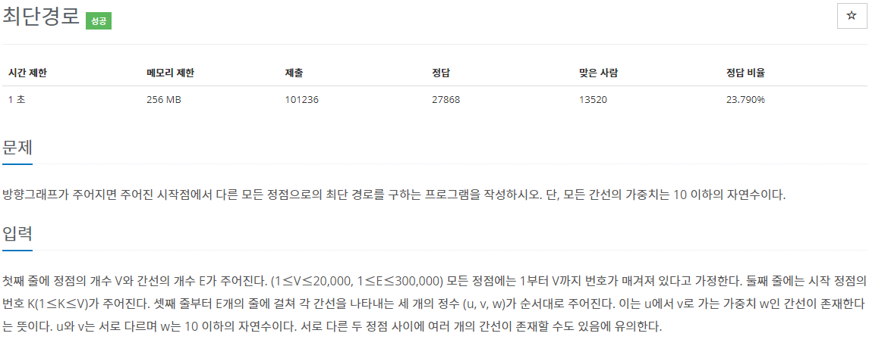

[문제](https://www.acmicpc.net/problem/1753)

이 전에 풀었던 다익스트라 기본 문제이지만, 같이 공부하는 친구에게 설명해 주려고 다시 풀었었다.

다익스트라는 목적지까지 가장 작은 경로로 탐색하는 알고리즘이다.

지금까지 했던 DFS나 BFS는 탐색을 하면서 방문했던 노드를 방문 안하고 계속해서 모든 경우의 수를 전부 비교한다.

하지만 다익스트라는 이미 지나온 길도 거리에 따라서 한번 더 지나갈 수 있는지 알아야 하기 때문에 현재까지의 비용을 비교하면서 진행한다.

그리고 우선 순위 큐를 사용해서 현재까지의 비용중 가장 적은 비용의 노드 먼저 탐색해서 시간복잡도를 줄여준다.

```
#include <stdio.h>
#include <iostream>

#include <queue>
#include <tuple>

const int INF = 99999999;

using namespace std;

typedef unsigned int UINT;

struct Node
{
	int index;
	int cost;
};

struct compare
{
	bool operator()(const Node& nodeL, const Node& nodeR)
	{
		return nodeL.cost > nodeR.cost;
	}
};

const vector<int> GetDistance(const vector<vector<Node>>& nodes, const int& startIndex)
{
	vector<int> cost(nodes.size(), INF);
	cost[startIndex] = 0;

	priority_queue<Node, vector<Node>, compare> pq;
	pq.push({ startIndex, 0 });

	while (!pq.empty())
	{
		Node linkedNode = pq.top();
		pq.pop();

		for (UINT i = 0; i < nodes[linkedNode.index].size(); i++)
		{
			int to = nodes[linkedNode.index][i].index;
			int destcost = nodes[linkedNode.index][i].cost + linkedNode.cost;

			Node node = { to, destcost };

			if (destcost < cost[to])
			{
				cost[to] = destcost;
				pq.push(node);
			}
		}
	}
	return cost;
}

int main()
{
	int V, E;
	cin >> V >> E;
	int K;
	cin >> K;

	vector<vector<Node>> nodes(V + 1);
	for (int i = 0; i < E; i++)
	{
		int u, v, w;
		cin >> u >> v >> w;

		nodes[u].push_back({ v,w });
	}

	vector<int> distance = GetDistance(nodes, K);
	for (UINT i = 1; i < distance.size(); i++)
	{
		if (distance[i] == INF) { cout << "INF" << "\n"; }
		else
		{
			cout << distance[i] << "\n";
		}
	}
}
```