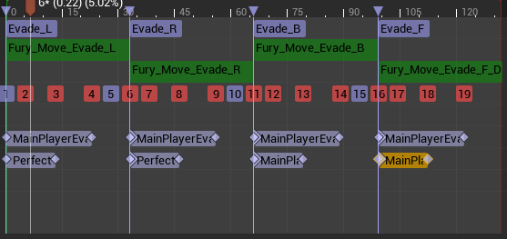
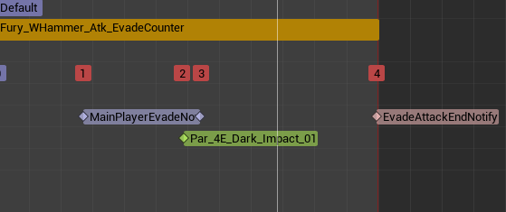
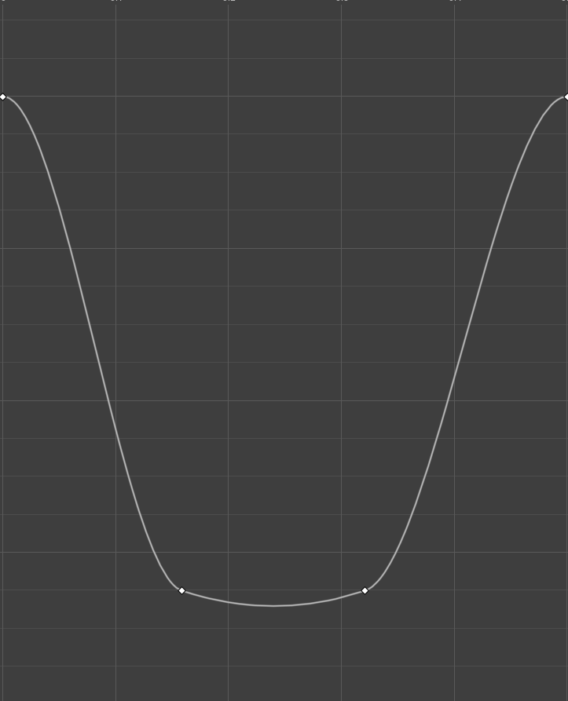

# Evade
  

각각 실행할 수 있게 만든뒤,

각각 회피 공격 몽타주를 만들어 준다.

그리고 시간을 느리게 할 때 사용할 커브도 만들어 준다.

0~0.5초 사이로 만들어 준다.

그리고 각각 무기에 몽타주를 넣어주고 실행을 해보자!!

슬로우 모션은 잘 된다.  
(끊기는게 아니다 슬로우 모션 맞다.)

그러면 이제 회피하면서 카운터 공격은?

각 무기마다 잘 된다(쌍절곤은 저게 카운터이긴 한데 이펙트가 없어서 너무 볼품없다 ㅠㅠ)

이제 보스몹 만들어야지....