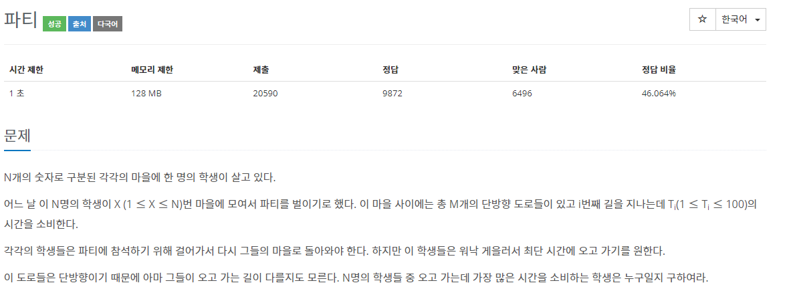

[문제](https://www.acmicpc.net/problem/1238)

다익스트라 알고리즘을 각 학생마다 두번 사용해서 비용을 구하는 문제이다.

가는 방향과 오는 방향으로 나눠 입력 받기 때문에 목적지 까지 갔던 길을 한번 더 가는 일은 없다.  
그래서 그냥 맘 놓고 구하면 된다.

```
#include <stdio.h>
#include <iostream>
#include <queue>
#include <vector>

#define INF 99999999

using namespace std;

struct Node
{
	int index;
	int cost;
};

struct compare
{
	bool operator()(const Node& lValue, const Node& rValue)
	{
		return lValue.cost > rValue.cost;
	}
};

const int GetCost(const vector<vector<Node>>& nodes, const int& startIndex, const int& destinationIndex, const int& size)
{
	vector<int> cost(size, INF);

	priority_queue<Node, vector<Node>, compare> pq;
	pq.push({ startIndex, 0 });
	cost[startIndex] = 0;

	while (!pq.empty())
	{
		Node currentNode = pq.top();
		pq.pop();

		for (int i = 0; i < nodes[currentNode.index].size(); i++)
		{
			int index = nodes[currentNode.index][i].index;
			int currentCost = nodes[currentNode.index][i].cost + currentNode.cost;

			if (currentCost < cost[index])
			{
				Node newNode = { index, currentCost };
				pq.push(newNode);
				cost[index] = currentCost;
			}
		}
	}

	int answer = cost[destinationIndex];
	cost.clear();
	cost.shrink_to_fit();
	return answer;
}

int main()
{
	int N, M, X;

	cin >> N >> M >> X;
	vector<vector<Node>> nodes(N + 1);
	for (int i = 0; i < M; i++)
	{
		int start, end, time;
		cin >> start >> end >> time;
		nodes[start].push_back({ end, time });
	}

	int answer = 0;
	for (int i = 1; i < nodes.size(); i++)
	{
		int first = GetCost(nodes, i, X, N + 1);
		int end = GetCost(nodes, X, i, N + 1);

		int result = first + end;
		if (answer < result)
		{
			answer = result;
		}
	}

	printf("%d\n", answer);
}
```