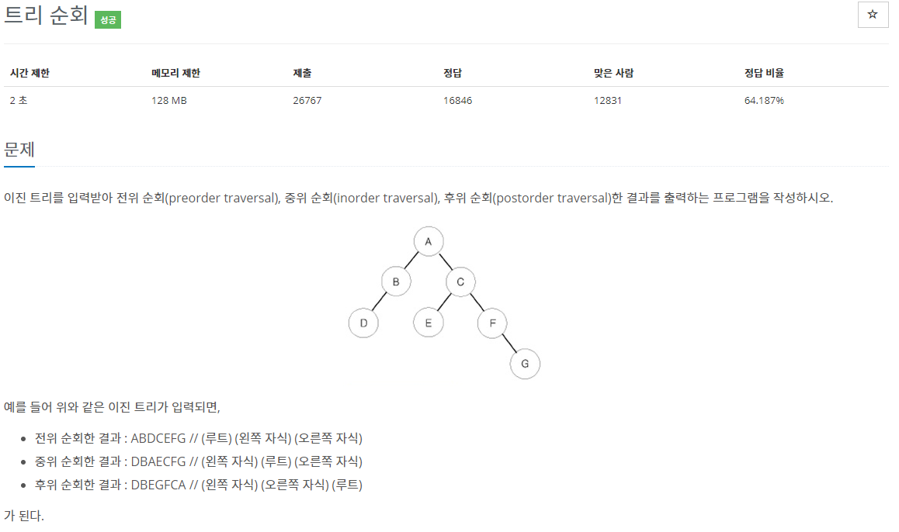

[문제](https://www.acmicpc.net/problem/1991)

2263문제를 풀기 전에 간단하게 풀기 위해 풀었다.

간단히 풀 수 있다.

각 노드마다 입력받고 왼쪽, 오른쪽 노드에 연결해준다.  
그리고 각 노드의 왼쪽 오른족을 탐색하는 과정 중 출력해주면 된다.

```
#include <stdio.h>
#include <iostream>

#include <vector>

using namespace std;

struct Node
{
	char alphabet;
	Node* left, * right;
};

void PreOrder(Node* node)
{
	if (node == NULL) { return; }
	printf("%c", node->alphabet);
	PreOrder(node->left);
	PreOrder(node->right);
}

void InOrder(Node* node)
{
	if (node == NULL) { return; }
	InOrder(node->left);
	printf("%c", node->alphabet);
	InOrder(node->right);
}

void PostOrder(Node* node)
{
	if (node == NULL) { return; }
	PostOrder(node->left);
	PostOrder(node->right);
	printf("%c", node->alphabet);
}

int main()
{
	vector<Node> tree(26, { '.', NULL, NULL });
	int N;
	cin >> N;

	for (int i = 0; i < N; i++)
	{
		char alphabet, left, right;
		cin >> alphabet >> left >> right;
		tree[alphabet - 'A'].alphabet = alphabet;
		if (left != '.')
		{
			tree[alphabet - 'A'].left = &tree[left - 'A'];
		}
		if (right != '.')
		{
			tree[alphabet - 'A'].right = &tree[right - 'A'];
		}
	}

	PreOrder(&tree[0]);
	printf("\n");
	InOrder(&tree[0]);
	printf("\n");
	PostOrder(&tree[0]);
	printf("\n");
}
```