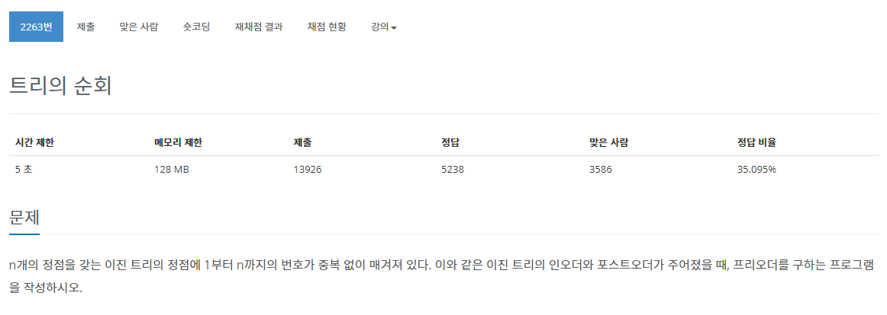

[문제](https://www.acmicpc.net/problem/2263)

인오더와 포스트오더의 출력 순서를 받고 프리오더를 출력하는 트리 문제이다.

```
In Order : 		8 4 2 9 5 1 10 6 3 11 7  
Post Order : 	8 4 9 5 2 10 6 11 7 3 1  
```
위에 오더순서에서 포스트오더의 맨 마지막의 숫자를 인오더에서 찾아보면  
루트 노드인 것을 알 수 있다. 루트노드를 기준으로 왼쪽 오른쪽으로 나누면 Left, Right 노드들인 것을 알 수 있다. 이 노드를 기준으로 계속해서 반복해서 찾으면 프리오더 순으로 노드들을 받을 수 있다.

