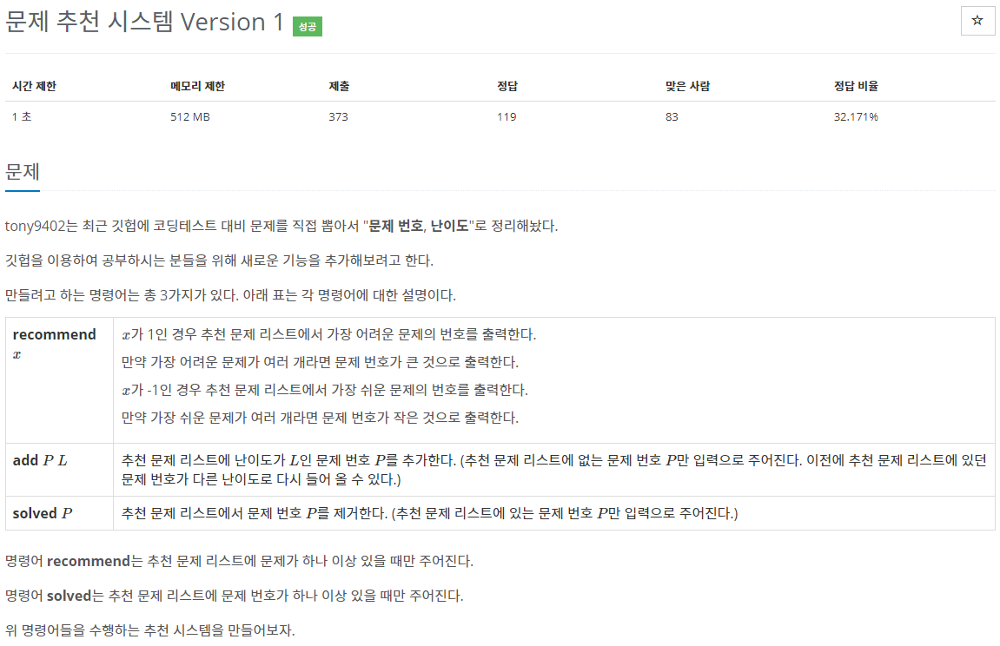

[문제](https://www.acmicpc.net/problem/21939)

생각보다 어려웠고 생각보다 풀기 쉬웠던 문제였다.

일단 두개의 우선순위 큐를 만들어 각각 난이도가 큰 문제, 작은 문제 순으로 설정해주자

그런 뒤, 문제를 받으면 넣어준다

이제 풀었는지 아니면 중복되는 문제인지는 큐를 다 빼서 수정하면 시간복잡도가 많이 늘어나기 때문에  
map을 사용해서 풀었는지와, 문제 난이도가 수정됐는지만 체크해주자.

마지막으로 recommend를 입력받을 때, 문제 난이도가 큐의 top과 맞지 않으면 pop해주고, 풀지 않았어도 pop해주고 다음것을 확인해서 출력해주자.

```
#include <stdio.h>
#include <iostream>

#include <string>

#include <queue>
#include <map>

using namespace std;

struct Backjoon
{
	int index;
	int difficulty;
};

struct CompareMin
{
	bool operator()(const Backjoon& lValue, const Backjoon& rValue)
	{
		if (lValue.difficulty == rValue.difficulty)
		{
			return lValue.index > rValue.index;
		}
		return lValue.difficulty > rValue.difficulty;
	}
};

struct CompareMax
{
	bool operator()(const Backjoon& lValue, const Backjoon& rValue)
	{
		if (lValue.difficulty == rValue.difficulty)
		{
			return lValue.index < rValue.index;
		}
		return lValue.difficulty < rValue.difficulty;
	}
};

map<int, bool> bIsSolved;
map<int, int> newBackjoon;
priority_queue<Backjoon, vector<Backjoon>, CompareMin> minPQ;
priority_queue<Backjoon, vector<Backjoon>, CompareMax> maxPQ;

void Add(const Backjoon& value)
{
	minPQ.push(value);
	maxPQ.push(value);
	newBackjoon[value.index] = value.difficulty;
	bIsSolved[value.index] = false;
}

void Solved(const int& index)
{
	bIsSolved[index] = true;
}

void Recommend(const int& temp)
{
	bool bIsEnd = false;
	if (temp == 1)
	{
		while (!bIsEnd)
		{
			Backjoon max = maxPQ.top();
			if (bIsSolved[max.index] == true)
			{
				maxPQ.pop();
			}
			else
			{
				printf("%d\n", max.index);
				bIsEnd = true;
				return;
			}
		}
	}
	else
	{
		while (!bIsEnd)
		{
			Backjoon min = minPQ.top();
			if (bIsSolved[min.index] == true)
			{
				minPQ.pop();
			}
			else
			{
				printf("%d\n", min.index);
				bIsEnd = true;
				return;
			}
		}
	}
}

int main()
{
	int N;
	cin >> N;
	for (int i = 0; i < N; i++)
	{
		Backjoon temp;
		cin >> temp.index >> temp.difficulty;
		Add(temp);
	}

	int M;
	cin >> M;
	for (int i = 0; i < M; i++)
	{
		string str;
		cin >> str;
		if (str[0] == 'a')
		{
			int index, difficulty;
			cin >> index >> difficulty;
			Add({ index, difficulty });
		}
		else if (str[0] == 's')
		{
			int index;
			cin >> index;
			Solved(index);
		}
		else if (str[0] == 'r')
		{
			int index;
			cin >> index;
			Recommend(index);
		}
	}
}
```

다 풀었는데 같은 문제 난이도 수정을 문제 잘못 읽어서 초큼 걸렸다. ㅋ