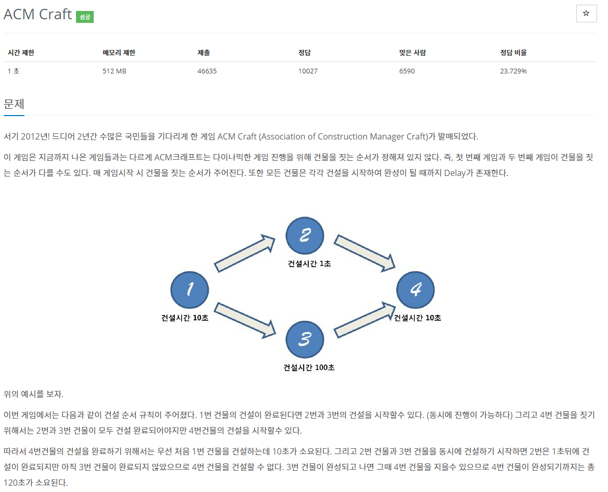

[문제](https://www.acmicpc.net/problem/1005)

위상 정렬에 관한 문제이다.  
처음 풀어본 알고리즘이기도 하고, 처음에는 위상 정렬이 아닌 그냥 DP로 풀었더니 시작 지점을 설정 못해서 틀렸었다.

위상 정렬에 관한 것은 처음들어봤는데  
각 노드에 연결되어있는 갯수가 0인 노드만 골라서 그래프탐색을 하는것이다.  
이렇게 하면 시작 노드에서 실행해서 각 노드가 끝나야지만 다음 노드가 실행되는 순서를 틀리지 않고 할 수 있기 때문에 사용한다.

```
#include <iostream>
#include <stdio.h>

#include <vector>
#include <queue>
#include <map>

using namespace std;   

struct Node
{
	int time;
	int index;
	int weight;
	vector<Node*> linkedNodes;
};

int GetTime(vector<Node>& nodes, const int& lastIndex)
{
	queue<Node*> q;
	vector<int> times(nodes.size());
	for (int i = 0; i < nodes.size(); i++)
	{
		if (nodes[i].weight == 0)
		{
			q.push(&nodes[i]);
		}
		times[i] = nodes[i].time;
	}
	
	while (nodes[lastIndex].weight > 0)
	{
		Node* currentNode = q.front();
		q.pop();
		for (int i = 0; i < currentNode->linkedNodes.size(); i++)
		{
			currentNode->linkedNodes[i]->time = max(currentNode->linkedNodes[i]->time, times[currentNode->linkedNodes[i]->index] + currentNode->time);
			currentNode->linkedNodes[i]->weight--;
			if (currentNode->linkedNodes[i]->weight == 0)
			{
				q.push(currentNode->linkedNodes[i]);
			}
		}

	}
	return nodes[lastIndex].time;
}

int main()
{
	int T, N, K;
	cin >> T;
	vector<int> results(T);
	for (int currentCount = 0; currentCount < T; currentCount++)
	{
		cin >> N >>  K;
		vector<Node> nodes(N);
		for (int i = 0; i < N; i++)
		{
			cin >> nodes[i].time;
			nodes[i].weight = 0;
			nodes[i].index = i;
		}
		vector<int> weight(N,0);
		for (int i = 0; i < K; i++)
		{
			int nodeIndex, linkedNode;
			cin >> nodeIndex >> linkedNode;
			nodes[nodeIndex - 1].linkedNodes.emplace_back(&nodes[linkedNode - 1]);
			nodes[linkedNode - 1].weight++;
		}
		int W;
		cin >> W;
		results[currentCount] = GetTime(nodes, W-1);
	}
	for (int i = 0; i < results.size(); i++)
	{		
		printf("%d\n", results[i]);
	}
}
```