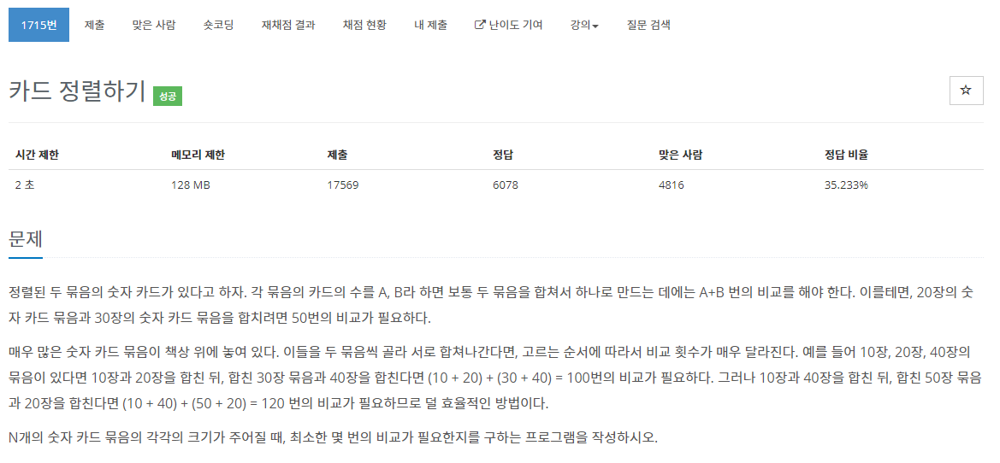

[문제](https://www.acmicpc.net/problem/1715)

잘 읽어야 실수를 안한다.  
처음에는 가장 적은 를 차례대로 더하는 뻘짓거리를 했다(데헷~!)

잘 읽어보면 가장 작은 수 두쌍씩 더해서 다시 그 수를 활용해서 더해주면 된다.

일단 가장 작은 수가 항상 나올 수 있도록 우선순위 큐를 활용하자  
그런 뒤, 2개를 더할 때 마다 큐에 넣어주고 그 수를 결과값에 더해준다.

```
#include <stdio.h>
#include <iostream>

#include <queue>

using namespace std;

struct compare
{
	bool operator()(const int& lValue, const int& rValue)
	{
		return lValue > rValue;
	}
};

int main()
{
	int N;
	cin >> N;
	priority_queue<int, vector<int>, compare> pq;
	for (int i = 0; i < N; i++)
	{
		int card;
		cin >> card;
		pq.push(card);
	}

	int amount = 0;
	int result = 0;
	bool bIsDouble = false;
	while (!pq.empty())
	{
		amount += pq.top();
		pq.pop();
		if (bIsDouble == true)
		{
			int temp = amount;
			pq.push(temp);
			result += amount;
			amount = 0;
		}
		bIsDouble = !bIsDouble;
	}
	printf("%d\n", result);
}
```
