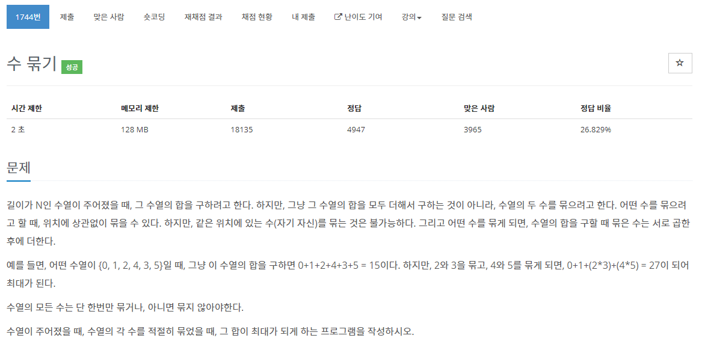

[문제](https://www.acmicpc.net/problem/1744)

좀 이게 한번에 할 수 있을거 같은데 내 머리로는 복잡해서 헿

우선순위 큐 2개를 만든다음에 0보다 큰 큐, 작거나 같은 큐 두개를 만든 뒤,  
큰큐는 그냥 곱해주고 더해준다.  하나남으면 그냥 더해준다.  만약 1이 나오면 곱해주지 않고 더해준다.
작은 큐는 곱해서 더해주다 0이랑 같이 있으면 곱하고 더해준다.

소스가 최큼 더럽다 헿

```
#include <stdio.h>
#include <iostream>

#include <vector>
#include <queue>

using namespace std;

struct compare
{
	bool operator()(const long long& lValue, const long long& rValue)
	{
		return lValue > rValue;
	}
};

long long GetValue(priority_queue<long long>& pq)
{
	long long amount = 0;
	while (!pq.empty())
	{
		if (pq.size() > 1)
		{
			long long value1 = pq.top();
			pq.pop();
			long long value2 = pq.top();
			pq.pop();

			if (value1 == 1 || value2 == 1)
			{
				amount += value1 + value2;
			}
			else if (value1 != 0 && value2 != 0)
			{
				amount += value1 * value2;
			}
			else
			{
				if (value1 > 0 || value2 > 0)
				{
					amount += value1 + value2;
				}
				else if (value1 < 0 || value2 < 0)
				{
					amount += value1 * value2;
				}
				else
				{
					amount += value1 + value2;
				}
			}
		}
		else
		{
			amount += pq.top();
			pq.pop();
		}
	}
	return amount;
}

long long GetValue(priority_queue<long long, vector<long long>, compare>& pq)
{
	long long amount = 0;
	while (!pq.empty())
	{
		if (pq.size() > 1)
		{
			long long value1 = pq.top();
			pq.pop();
			long long value2 = pq.top();
			pq.pop();

			if (value1 != 0 && value2 != 0)
			{
				amount += value1 * value2;
			}
			else
			{
				if (value1 > 0 || value2 > 0)
				{
					amount += value1 + value2;
				}
				else if (value1 < 0 || value2 < 0)
				{
					amount += value1 * value2;
				}
				else
				{
					amount += value1 + value2;
				}
			}
		}
		else
		{
			amount += pq.top();
			pq.pop();
		}
	}
	return amount;
}

int main()
{
	int N;
	cin >> N;
	priority_queue<long long> maxpq;
	priority_queue<long long, vector<long long>, compare> minpq;
	for (int i = 0; i < N; i++)
	{
		int temp;
		cin >> temp;
		if (temp > 0)
		{
			maxpq.push(temp);
		}
		else
		{
			minpq.push(temp);
		}
	}

	long long amount = 0;

	amount = GetValue(maxpq) + GetValue(minpq);

	cout << amount << "\n";
}
```