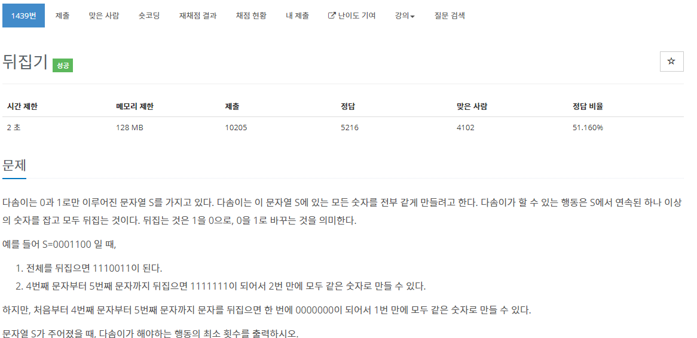

[문제](https://www.acmicpc.net/problem/1439)

뒤집뒤집

간단하다 탐색하면서 연속되는 카운트가 적은 숫자만 뒤집으면 된다

```
#include <stdio.h>
#include <iostream>

#include <string>

using namespace std;

int main()
{
	string s;
	cin >> s;

	int zeroCount = 0;
	int oneCount = 0;
	for (int i = 0; i < s.length(); i++)
	{
		if (s[i] == '0')
		{
			while(i<s.length() && s[i] == '0'){i++;}
			zeroCount++;
			i--;
		}
		else
		{
			while(i < s.length() && s[i] == '1'){i++;}
			oneCount++;
			i--;
		}
	}

	cout << min(oneCount, zeroCount) << "\n";
}
```