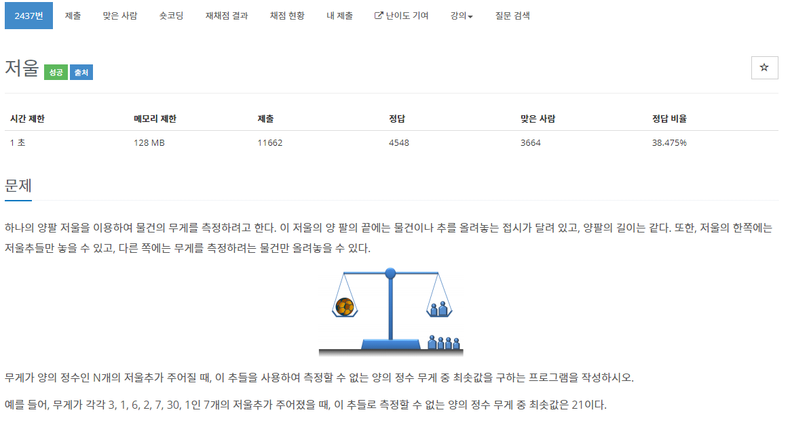

[문제](https://www.acmicpc.net/problem/2437)

솔직히 못풀었다..... ㅠㅠ

그래서 규칙은 오름차순으로 정렬한 뒤, 하나씩 차래대로 더하면서 그 다음수와 비교했을때 그 다음수가 지금까지 더한 수보다 클 경우 다음 수가 나오지 않는다는 규칙이다.

```
#include <stdio.h>
#include <iostream>

#include <vector>
#include <algorithm>

using namespace std;

int main()
{
	int N;
	cin >> N;

	vector<int> v(N);
	for (int i = 0; i < N; i++)
	{
		cin >> v[i];
	}

	sort(v.begin(), v.end());

	if (v[0] != 1)
	{
		printf("1\n");
		return 0;
	}

	int amount = v[0];
	for (int i = 1; i < N; i++)
	{
		if (amount + 1 < v[i])
		{
			break;
		}
		else
		{
			amount += v[i];
		}
	}
	printf("%d\n", amount + 1);
}
```