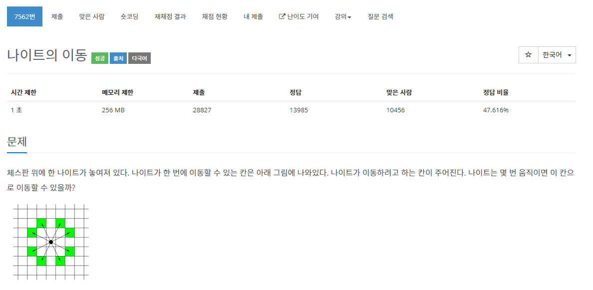

[문제](https://www.acmicpc.net/problem/7562)

다익스트라 문제이다.

각 부분까지 이동했을 때, 걸린 횟수를 Cost로 두고 다익스트라 알고리즘을 사용하면 금방 풀린다.

코드
```

#include <stdio.h>
#include <iostream>

#include <queue>
#include <vector>

using namespace std;

struct Vector2
{
	int x;
	int y;
	int cost;
};

Vector2 operator+(const Vector2& lValue, const Vector2& rValue)
{
	return {lValue.x + rValue.x, lValue.y + rValue.y};
}

struct compare
{
	bool operator()(const Vector2& lValue, const Vector2& rValue)
	{
		return lValue.cost > rValue.cost;
	}
};

Vector2 dir[8] = { {2, 1}, {-2, 1}, {2, -1}, {-2, -1}, {1, 2}, {1, -2} , {-1, 2} , {-1, -2} };

void PrintVector(const vector<vector<int>>& v)
{
	printf("\n");
	for (int i = 0; i < v.size(); i++)
	{
		for (int j = 0; j < v[i].size(); j++)
		{
			if (v[i][j] == 99999999)
			{
				printf("INF\t");
			}
			else
			{
				printf("%d\t", v[i][j]);
			}
		}
		printf("\n");
	}
	printf("\n");
}

int GetDistanceByDJ(const int& size, const Vector2& startPosition, const Vector2& destination)
{
	priority_queue<Vector2, vector<Vector2>, compare> pq;


	pq.push(startPosition);
	vector<vector<int>> cost(size, vector<int>(size, 99999999));
	cost[startPosition.y][startPosition.x] = 0;

	while (!pq.empty())
	{
		Vector2 currentPosition = pq.top();
		pq.pop();

		for (int i = 0; i < 8; i++)
		{
			Vector2 movePosition = currentPosition + dir[i];

			if(movePosition.x < 0 || movePosition.x >= size || movePosition.y < 0 || movePosition.y >= size){continue;}

			int currentCost = currentPosition.cost + 1;

			if (cost[movePosition.y][movePosition.x] > currentCost)
			{
				movePosition.cost = currentCost;
				cost[movePosition.y][movePosition.x] = currentCost;
				pq.push(movePosition);
			}
		}
		PrintVector(cost);
	}
	return cost[destination.y][destination.x];
}

int GetDistanceByBFS(const int& size, const Vector2& startPosition, const Vector2& destination)
{
	queue<Vector2> q;
	vector<vector<int>> cost(size, vector<int>(size, 99999999));
	vector<vector<bool>> bIsVieited(size, vector<bool>(size, false));
	cost[startPosition.y][startPosition.x] = 0;
	q.push(startPosition);

	while (!q.empty())
	{
		Vector2 currentPosition = q.front();
		q.pop();

		if (bIsVieited[currentPosition.y][currentPosition.x] == true) { continue; }
		bIsVieited[currentPosition.y][currentPosition.x] = true;

		for (int i = 0; i < 8; i++)
		{
			Vector2 movePosition = currentPosition + dir[i];

			int currentCost = currentPosition.cost + 1;

			if (movePosition.x < 0 || movePosition.x >= size || movePosition.y < 0 || movePosition.y >= size) { continue; }

			if (cost[movePosition.y][movePosition.x] > currentCost)
			{
				movePosition.cost = currentCost;
				cost[movePosition.y][movePosition.x] = currentCost;
			}
			q.push(movePosition);
		}
		PrintVector(cost);
	}
	return cost[destination.y][destination.x];
}

int main()
{
	int testCount;
	cin >> testCount;
	vector<int> results(testCount);
	for (int i = 0; i < testCount; i++)
	{
		int size;
		cin >> size;

		Vector2 start, end;

		cin >> start.x >> start.y;
		start.cost = 0;
		cin >> end.x >> end.y;
		end.cost = 0;

		results[i] = GetDistanceByBFS(size, start, end);
	}

	for (int i = 0; i < testCount; i++)
	{
		cout << results[i] << "\n";
	}
}
```
BFS로 풀었을 때도 같은 답이 나오긴 했는데 약간 살짝 더 느리다.
