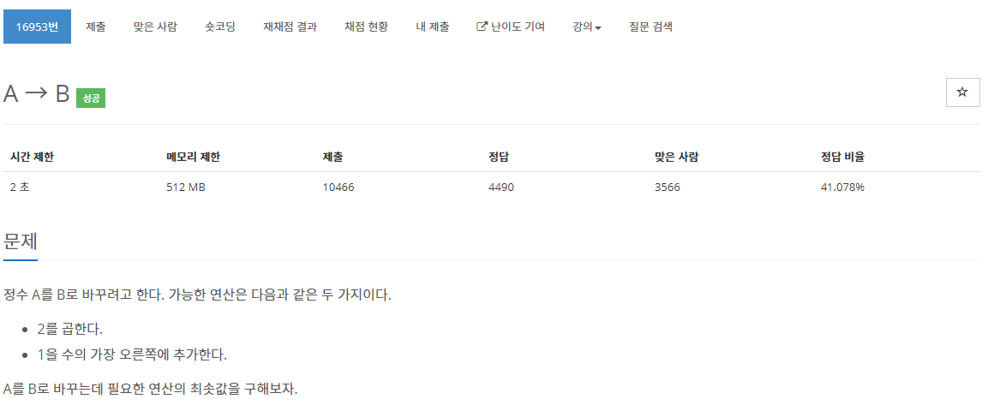

[문제](https://www.acmicpc.net/problem/16953)

이 문제는 거꾸로 가면 된다.

만약 2 162를 입력받았을 경우 162에서 출발한다.  
10으로 나눴을 때, 나머지가 1이 나오면 10을 나눠주고 아닐경우 2로 나눠주면 된다.  
마지막으로 같은 수일 경우 -1 같을 경우 횟수를 출력해준다.

```
#include <stdio.h>
#include <iostream>

using namespace std;

void Swap(int& lValue, int& rValue)
{
	int temp = lValue;
	lValue = rValue;
	rValue = temp;
}

int main()
{
	long long from, to;
	cin >> to >> from;
	int count = 0;


	while (from > to)
	{
		if (from % 10 == 1)
		{
			from /= 10;
		}
		else if (from % 2 == 0)
		{
			from /= 2;
		}
		else
		{
			printf("-1\n");
			return 0;
		}
		count++;
	}
	if (from == to)
	{
		printf("%d\n", count + 1);
	}
	else
	{
		printf("-1\n");
	}
}
```