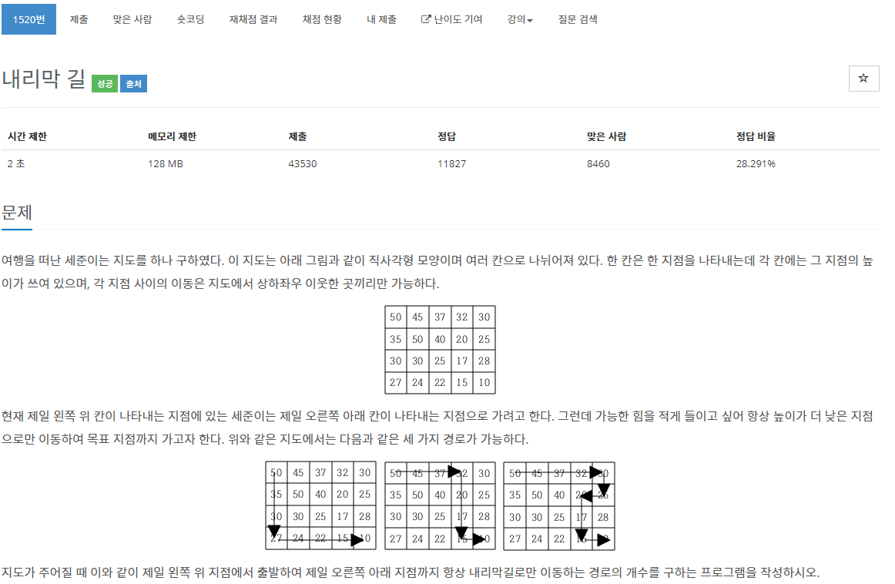
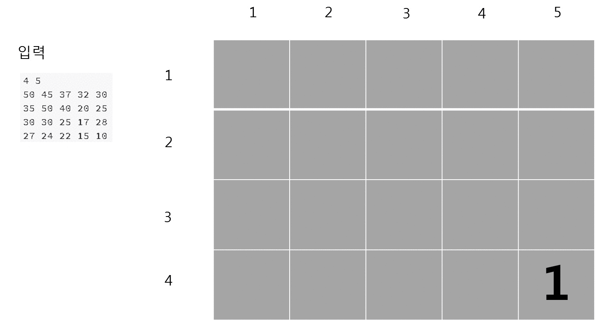

[문제](https://www.acmicpc.net/problem/1520)

간단하게 풀려 했지만 역시 시간초과가 났다.

DFS와 DP를 적절하게 섞어야 한다.

재귀함수로 실행해서 마지막 도착점까지 도착했을 시 그 부분을 1개의 경로로 갈 수 있다고 체크해준다.  
그러고 재귀를 한 뒤, 반대로 돌아올 때, 현재 경로에서 도착경로의 경우의 수를 더해준다.

[출처 : https://wootool.tistory.com/83](https://wootool.tistory.com/83)

이런식이다.

```
#include <stdio.h>
#include <iostream>

#include <vector>

using namespace std;

struct Vector2
{
	int x, y;
};

Vector2 operator+(const Vector2& position1, const Vector2& position2)
{
	return { position1.x + position2.x, position1.y + position2.y };
}

Vector2 dir[4] = { {1,0}, {0,1}, {-1,0}, {0,-1} };

void GetCount(const vector<vector<int>>& v, vector<vector<int>>& DP, const Vector2& currentPosition, const int& W, const int& H)
{
	if (currentPosition.x == W - 1 && currentPosition.y == H - 1)
	{
		DP[currentPosition.y][currentPosition.x] = 1;
		return;
	}

	if (DP[currentPosition.y][currentPosition.x] != -1) { return; }
	DP[currentPosition.y][currentPosition.x] = 0;
	for (int i = 0; i < 4; i++)
	{
		Vector2 movePosition = currentPosition + dir[i];
		if (movePosition.x < 0 || movePosition.x >= v[0].size() || movePosition.y < 0 || movePosition.y >= v.size()) { continue; }
		int from = v[currentPosition.y][currentPosition.x];
		int to = v[movePosition.y][movePosition.x];
		if (from > to)
		{
			GetCount(v, DP, movePosition, W, H);
			DP[currentPosition.y][currentPosition.x] += DP[movePosition.y][movePosition.x];
		}
	}
}

int main()
{
	int w, h;
	cin >> h >> w;

	vector<vector<int>> v(h, vector<int>(w));
	vector<vector<int>> DP(h, vector<int>(w, -1));
	for (int i = 0; i < h; i++)
	{
		for (int j = 0; j < w; j++)
		{
			cin >> v[i][j];
		}
	}

	GetCount(v, DP, { 0,0 }, w, h);

	cout << DP[0][0] << "\n";
}
```