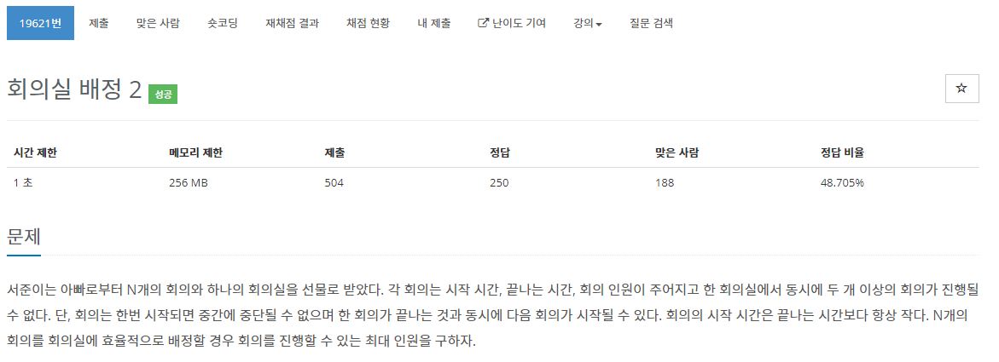

[문제](https://www.acmicpc.net/problem/19621)

또 다른 회의실 배정 문제이다. 이번 문제는 일반적으로 풀면 시간이 너무 걸려서 실패한다. 그래서 DP로 풀면 풀 수 있다.

```
#include <iostream>
#include <vector>
#include <algorithm>

using namespace std;

struct Conference
{
	int startTime;
	int endTime;
	int personnel;
};

bool Compare(const Conference& lValue, const Conference& rValue)
{
	if (lValue.endTime == rValue.endTime)
	{
		return lValue.startTime < rValue.startTime;
	}

	return lValue.endTime < rValue.endTime;
}

int main()
{
	int N;
	cin >> N;
	vector< Conference> v(N);
	for (int i = 0; i < N; i++)
	{
		cin >> v[i].startTime >> v[i].endTime >> v[i].personnel;
	}
	sort(v.begin(), v.end(), Compare);

	int totalMax = 0;
	for (int i = 0; i < N; i++)
	{	
		int maxValue = v[i].personnel;
		for (int j = i - 1; j >= 0; j--)
		{
			if (v[i].startTime >= v[j].endTime)
			{
				maxValue = max(maxValue, v[i].personnel + v[j].personnel);
			}
		}
		v[i].personnel = maxValue;
		totalMax = max(totalMax, maxValue);
	}

	cout << totalMax << endl;
}

```