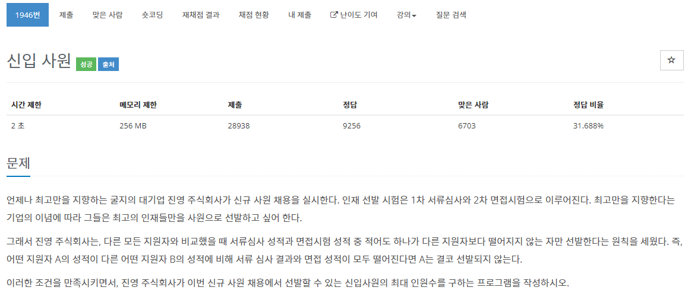

[문제](https://www.acmicpc.net/problem/1946)

회의실과 비슷한 문제이다.  

일단 첫번째 수로 정렬을 하고 그 뒤, 그 다음 수를 비교하면서 가장 큰 값을 찾으면 횟수를 올리고 큰 값을 갱신해준다.

```
#include <iostream>
#include <vector>

#include <algorithm>

using namespace std;

struct Person
{
	int testValue;
	int interviewValue;
};

bool ComparePerson(const Person& lValue, const Person& r
{
	if (lValue.testValue == rValue.testValue)
	{
		return lValue.interviewValue > rValue.interviewVal
	}

	return lValue.testValue < rValue.testValue;
}

int GetPersonCount(vector<Person>& v)
{
	sort(v.begin(), v.end(), ComparePerson);

	int maxRank = v[0].interviewValue;
	int count = 1;
	for (int i = 1; i < v.size(); i++)
	{
		if (maxRank > v[i].interviewValue)
		{
			count++;
			maxRank = v[i].interviewValue;
		}
	}
	return count;
}

int main()
{
	int T;
	cin >> T;

	for (int i = 0; i < T; i++)
	{
		int N;
		cin >> N;
		vector<Person> v(N);
		for (int j = 0; j < N; j++)
		{
			cin >> v[j].testValue >> v[j].interviewValue;
		}

		cout << GetPersonCount(v) << "\n";
	}
}
```