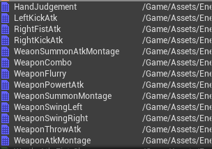

흐어어어 간만에 언리얼 포스팅이다. 최근에 추석도 있고 회사 코딩테스트도 있고 그래서 좀 쉬었다.(또 변명이다.)

현재 Wrath의 공격 타입을 두개(무기 있음, 없음)으로 나눴다.  
그래서 나는 것을 적용하기 위해 공격들의 AnimMontage를 만들어준다.



이렇게 만들어 주고, 각 몽타주에 AnimNotify를 만들어서 넣어준다.

AnimNotify는 각 무기 부분(Left, Right)의 콜라이더를 껏다 켜줬다 해주고, 맨손의 각 부분(발 다리 왼쪽 오른쪽)의 콜라이더를 껏다 켜주는것을 넣어준다.  
그런 뒤, 현재 데미지를 계속해서 업데이트 해줄 수 있는 

```
void AEnemyWrath::NextAttackDamage()
{
	if(CurrentAttack.CurrentAttackInfo)
	{
		if (Weapon)
		{
			Weapon->SetCurrentDamage(CurrentAttack.CurrentAttackInfo->Damages[CurrentDamageIndex]);
		}
		CurrentDamage = CurrentAttack.CurrentAttackInfo->Damages[CurrentDamageIndex];
		CurrentDamageIndex++;
		CurrentDamageIndex %= CurrentAttack.CurrentAttackInfo->Damages.Num();
	}
}
```
이 함수를 만들어 넣어주자

그런 뒤, 공격이 끝났음을 체크하고 ,
```
void AEnemyWrath::EndAttack()
{
	SetCurrentState(EEnemyState::ES_Targeting);
	CurrentAttack.CurrentAttackInfo = NULL;
}
```
이 함수도 실행할 수 있는 AnimNotify를 만들어 주자.

그리고 공격할 때, 사용하지 않던 State인 IdleState를 사용해서 다른 행동을 못하게 만들어주고, Montage를 실행시켜주자

```
void AEnemyWrath::PlayAttack(FAttackInfo* AttackInfo)
{
	if (AttackInfo)
	{
		SetCurrentState(EEnemyState::ES_Idle);
		if (AIController)
		{
			AIController->SetFocus(NULL);
		}
		PlayAttackAnimation(AttackInfo->AttackMontage);
	}
	else
	{
		SetCurrentState(EEnemyState::ES_Targeting);
	}
}
```

그리고 AttackState 부분을 만들어준다.  
현재 공격의 거리에 따라 공격 거리를 재서 공격해준다.
<details>
<summary style="color:green">MainPlayer.cpp</summary>
<div markdown="1">

```
void AEnemyWrath::AttackEnter()
{
	Super::AttackEnter();
	UE_LOG(LogTemp, Log, TEXT("AttackEnter"));
}

void AEnemyWrath::Attack()
{
	if(CurrentAttack.CurrentAttackInfo == NULL)
	{
		SetCurrentState(EEnemyState::ES_Targeting);
	}

	if(TargetActor)
	{
		FAIMoveRequest MoveRequest;
		MoveRequest.SetGoalActor(TargetActor);
		MoveRequest.SetAcceptanceRadius(10.0f);

		FNavPathSharedPtr NavPath;

		AIController->MoveTo(MoveRequest, &NavPath);

		const float CurrentDistance = FVector::Distance(TargetActor->GetActorLocation(), GetActorLocation());
		switch(CurrentAttack.DistanceType)
		{
			case EEnemyAttackDistanceType::EADT_Far:
			if(CurrentDistance <= FarRangeAttackDistance)
			{
				PlayAttack(CurrentAttack.CurrentAttackInfo);
			}
			break;
			case EEnemyAttackDistanceType::EADT_Close:
			if(CurrentDistance <= CloseRangeAttackDistance)
			{
				PlayAttack(CurrentAttack.CurrentAttackInfo);
			}
			break;
		}
	}
}

void AEnemyWrath::AttackExit()
{
	if(CurrentAttack.CurrentAttackInfo)
	{
		SetRestTime(CurrentAttack.CurrentAttackInfo->RestTime);
	}
}
```

</div>
</details>


<details>
<summary style="color:green">MainPlayer.cpp</summary>
<div markdown="1">

```

void AEnemyWrath::SetAttackInfo()
{
	if(CurrentAttack.CurrentAttackInfo != NULL)
	{
		return;
	}
	switch (CurrentWeaponType)
	{
		case EEnemyWeaponType::EWT_Sword:
			if (TargetActor)
			{
				float const Distance = FVector::Distance(TargetActor->GetActorLocation(), GetActorLocation());

				if (Distance < CloseRangeAttackDistance)
				{
					CurrentAttack.DistanceType = EEnemyAttackDistanceType::EADT_Close;
					SetAttackMontage(SwordCloseRangeAttackInfos);
				}
				else if (Distance >= CloseRangeAttackDistance && Distance < FarRangeAttackDistance)
				{
					CurrentAttack.DistanceType = EEnemyAttackDistanceType::EADT_Far;
					SetAttackMontage(SwordFarRangeAttackInfos);
				}
				else
				{
					//CurrentAttack.CurrentAttackInfo = NULL;
					//SetCurrentState(EEnemyState::ES_Targeting);
				}
			}
		break;
		case EEnemyWeaponType::EWT_Fist:;
			CurrentAttack.DistanceType = EEnemyAttackDistanceType::EADT_Close;
			SetAttackMontage(FistAttackInfos);
		break;
	}
}

void AEnemyWrath::SetAttackMontage(TArray<FAttackInfo>& Infos)
{
	TArray<FAttackInfo*> SelectableAttacks;
	for (int i = 0; i < Infos.Num(); i++)
	{
		if (Infos[i].CurrentCoolTime >= Infos[i].CoolTime)
		{
			SelectableAttacks.Add(&Infos[i]);
		}
	}
	if(SelectableAttacks.Num() > 0)
	{
		const int RandomValue = FMath::RandRange(0, SelectableAttacks.Num() - 1);
		CurrentAttack.CurrentAttackInfo = SelectableAttacks[RandomValue];
		CurrentDamageIndex = 0;
		NextAttackDamage();
	}
}
```

</div>
</details>

그리고 현재 공격을 정해주는 함수도 만들어주자.