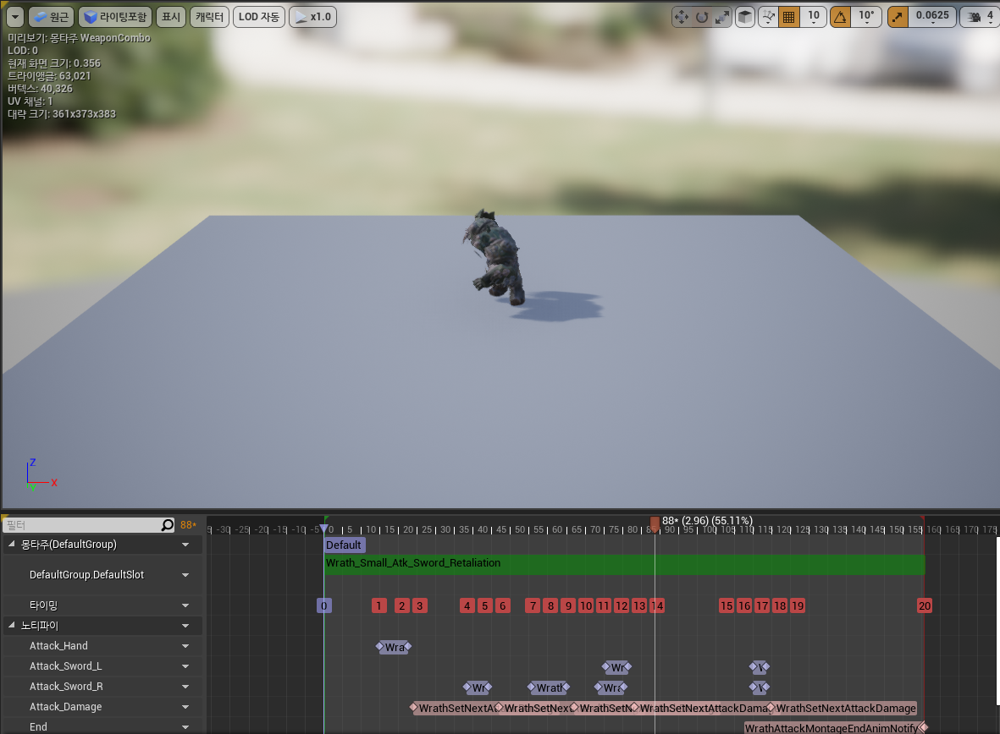

AttackMontage의 AnimNotify를 만들어주자

소스가 너무 반복적이고 단조로워 설명만 한다.

각 콜라이더 켜주고 꺼주고, 끝날때 wrath에 있는 함수 호출 끝이다.

대부분 이런식이다.  
그리고 콤보공격은

이런식으로 했다.

이렇게 만든 뒤, 테스트를 해보자.

  
(용량이 초큼 크다.)

각 공격에 적용되어 있는 RestTime이 끝나면 쿨타임이 다 돈 공격들 중에 하나를 랜덤으로 택하고 공격해준다. 반복이다.  

생각보다 잘 된다. 다음에는 각 공격을 좀 더 디테일하게 만들어보자.