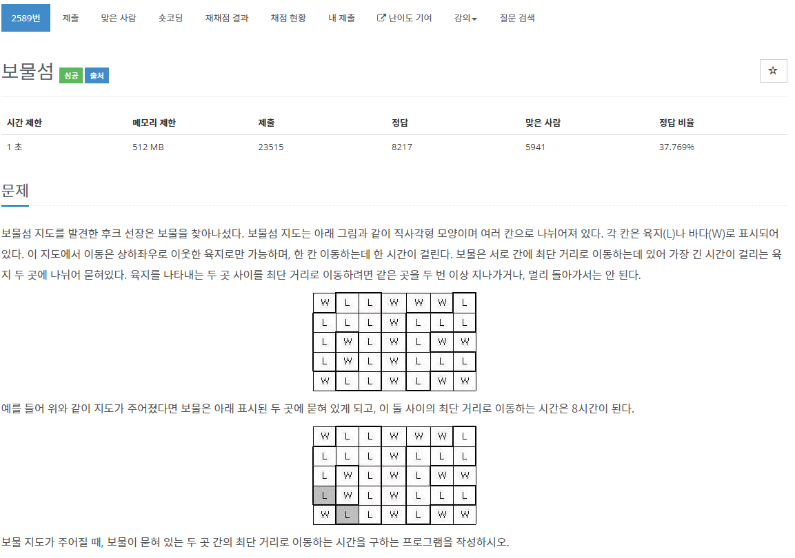

[문제](https://www.acmicpc.net/problem/2589)

브루트포스 그래프 문제이다. 각 지점마다 걸리는 시간을 갖고와서 가장 큰 값을 갖고온다.

```
#include <iostream>
#include <queue>
#include <vector>

using namespace std;

constexpr int INF = 99999999;

struct Vector2
{
	int cost;
	int x, y;

	Vector2 operator+(const Vector2& v) const
	{
		return { 0, this->x + v.x, this->y + v.y };
	}
};

Vector2 dir[4] = { {0,1,0}, {0,-1,0}, {0, 0,1},{0,0,-1} };

struct VectorCompare
{
	bool operator()(const Vector2& lValue, const Vector2& rValue) const
	{
		return lValue.cost > rValue.cost;
	}
};

int GetCount(const vector<string>& v, const Vector2& startPosition)
{
	if(v[startPosition.y][startPosition.x] == 'W'){return -1;}
	priority_queue<Vector2, vector<Vector2>, VectorCompare> pq;
	pq.push(startPosition);
	vector<vector<int>> cost(v.size(), vector<int>(v[0].size(), INF));
	cost[startPosition.y][startPosition.x] = 0;
	while (!pq.empty())
	{
		Vector2 currentPosition = pq.top();
		pq.pop();

		for(int i = 0 ; i < 4; i++)
		{
			Vector2 movePosition = currentPosition + dir[i];

			if(movePosition.x < 0 || movePosition.x >= v[0].size() || movePosition.y < 0 || movePosition.y >= v.size()){continue;}
			if(v[movePosition.y][movePosition.x] == 'W'){continue;}

			const int curCost = currentPosition.cost + 1;
			if(curCost < cost[movePosition.y][movePosition.x])
			{
				movePosition.cost = curCost;
				cost[movePosition.y][movePosition.x] = curCost;
				pq.push(movePosition);
			}
		}
	}
	int maxCost = 0;
	for(int i = 0 ; i < cost.size(); i++)
	{
		for(int j = 0 ; j < cost[i].size() ;j++)
		{
			if(cost[i][j] != INF)
			{
				maxCost = max(maxCost, cost[i][j]);
			}
		}
	}
	return maxCost;
}

int main()
{
	int W, H;
	cin >> H >> W;

	vector<string> v(H);

	for(int i = 0; i < H; i++)
	{
		cin >> v[i];
	}

	int maxValue = 0;
	for(int i = 0 ; i < H ; i++)
	{
		for(int j = 0 ; j < W; j++)
		{
			maxValue = max(maxValue, GetCount(v, {0,j,i}));
		}
	}

	cout << maxValue << "\n";
}

```