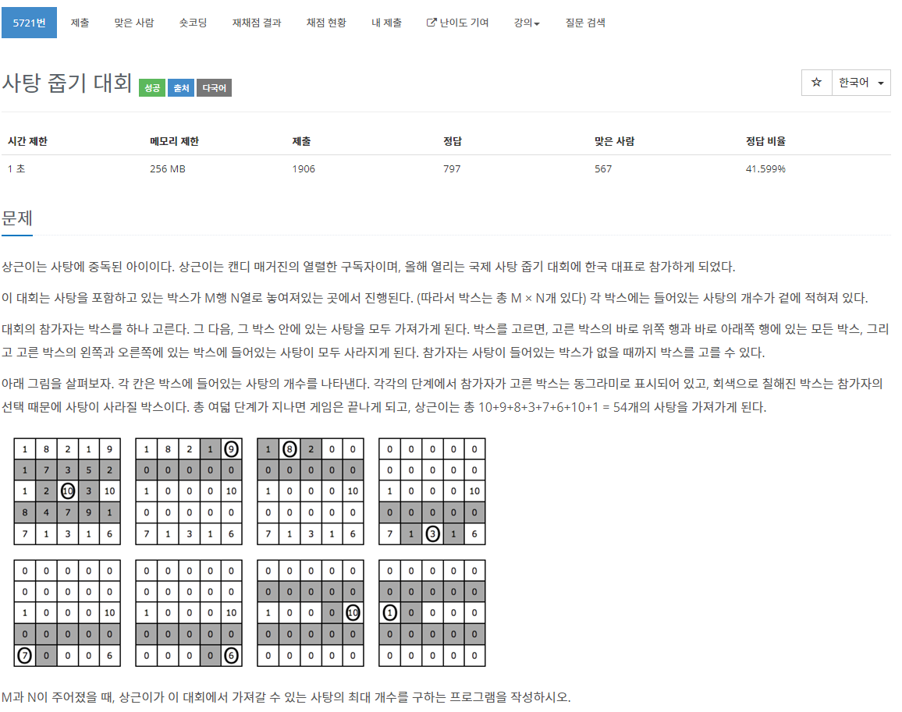

[문제](https://www.acmicpc.net/problem/5721)

처음에 일반적으로 풀었는데 역시 틀렸다. ㅋ  

DP로 풀면 가능하다. 각 가로에서 가장 큰 값을 가질 수 있게 연산하고, 세로에서도 그 작업을 하면 된다.

역시... DP 어렵...

```
#include <iostream>
#include <queue>
#include <vector>

using namespace std;

int GetMaxCount(const vector<int>& v)
{
	int maxCount;

	if (v.size() > 1)
	{
		vector<int> DP(v.size(), 0);
		for (int i = 0; i < v.size(); i++)
		{
			DP[i] = v[i];
		}
		maxCount = max(DP[0], DP[1]);
		for (int i = 1; i < v.size(); i++)
		{
			if(i == 1)
			{
				DP[i] = maxCount;
			}
			else
			{
				DP[i] = max(DP[i - 1], DP[i - 2] + DP[i]);
			}
			maxCount = max(maxCount, DP[i]);
		}
		maxCount = DP[DP.size()-1];
	}
	else
	{
		maxCount = v[0];
	}
	return maxCount;
}

int main()
{
	vector<int> results;
	while (true)
	{
		int M, N;
		cin >> M >> N;
		if (M == 0 || N == 0) { break; }
		vector<vector<int>> v(M, vector<int>(N, 0));
		for (int i = 0; i < M; i++)
		{
			for (int j = 0; j < N; j++)
			{
				cin >> v[i][j];
			}
		}

		vector<int> DP(M);
		for (int i = 0; i < M; i++)
		{
			DP[i] = GetMaxCount(v[i]);
		}

		results.emplace_back(GetMaxCount(DP));
	}
	for (int i = 0; i < results.size(); i++)
	{
		cout << results[i] << "\n";
	}
}
```