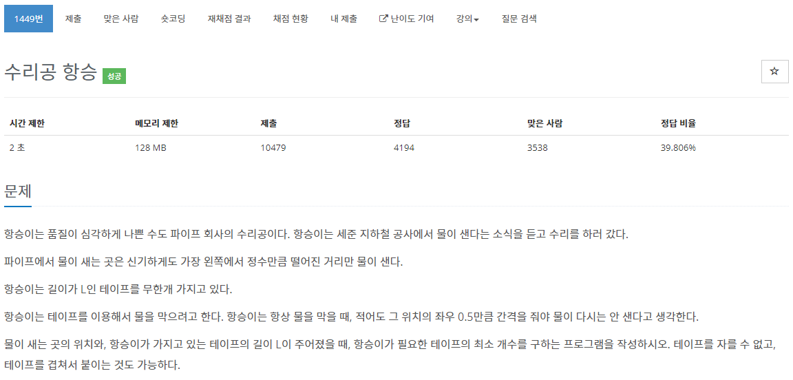

[문제](https://www.acmicpc.net/problem/1449)

그냥 주어진 수만큼 연결 되어있고 + 1 만큼 되어있으면 카운트를 하나 올려준다.

```
#include <iostream>
#include <algorithm>
#include <vector>

using namespace std;

int main()
{
	int N , L;
	cin >> N >> L;

	vector<int> water(N);

	for(int i = 0 ; i <  N ; i++)
	{
		cin >> water[i];
	}
	sort(water.begin(), water.end());

	int count = 1;
	int start = water[0];
	for(int i = 1 ; i < N; i++)
	{
		if(water[i] - start > L - 1)
		{
			count++;
			start = water[i];
		}
	}

	cout << count << "\n";
}
```