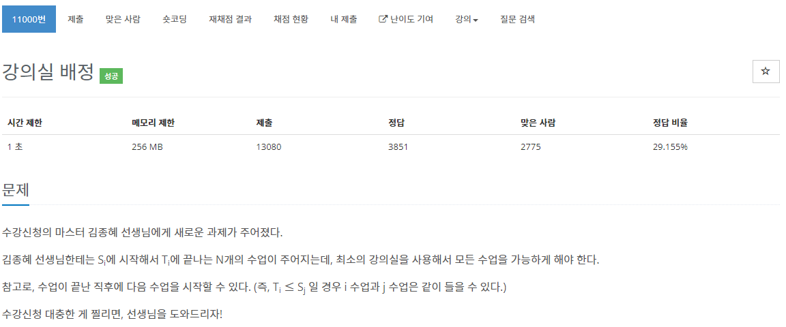

[문제](https://www.acmicpc.net/problem/11000)

저번에 비슷한 문제를 풀었다

일단 처음에 강의실을 오름차순으로 정리하고  
끝나는 시간 기점으로 오름차순으로 만들어준다.  
그리고 강의가 시작되면 우선순위 큐에 끝나는 시간과 시작하는 시간을 비교한뒤  
만약 시작하는 시간이 크거나 같으면  우선순위 큐를 pop 해준다. 그런 뒤 그 강의 시간을 우선순위 큐에 넣는다. 작을 경우 그냥 큐에 넣어준다.

마지막으로 큐 안에 남은 갯수가 현재 사용하고 있는 강의실의 최소 갯수가 된다.

```
#include <iostream>
#include <queue>
#include <vector>
#include <algorithm>

using namespace std;

struct Room
{
	int start, end;

	bool operator < (const Room& value) const
	{
		if (this->start == value.start)
		{
			return this->end < value.end;
		}
		return this->start < value.start;
	}
};

struct Compare
{
	bool operator()(const Room& lValue, const Room& rValue) const
	{
		return lValue.end > rValue.end;
	}
};

int main()
{
	int N;
	cin >> N;
	vector<Room> rooms(N);
	priority_queue<Room, vector<Room>, Compare> pq;
	for(int i = 0 ; i < N ; i++)
	{
		int start, end;
		cin >> start >> end;

		rooms[i] = {start, end};
	}

	sort(rooms.begin(), rooms.end());
	
	pq.push(rooms[0]);

	for(int i = 1 ; i < N; i++)
	{
		const Room curRoom = pq.top();
		if(rooms[i].start >= curRoom.end)
		{
			pq.pop();
		}
		pq.push(rooms[i]);
	}

	cout << pq.size() << endl;
}
```
