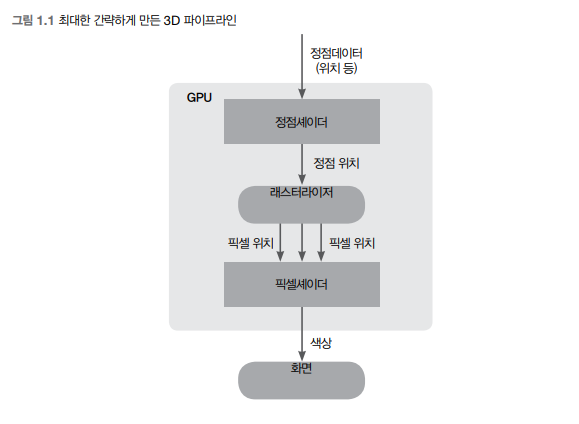

[책 셰이더 프로그래밍 입문 (저자 : Pope Kim)](https://www.hanbit.co.kr/store/books/look.php?p_code=B8421024205)을 보면서 작성했습니다.  

이 전에 DX11을 공부할 때 같이 공부하긴 했지만, 이것만 중점적으로 하진 않았다.  
그래서 이것만 따로 공부하면 좋을것 같아서 공부 하게되었다.  
따라서 DirectX에 관한 실행은 설명 안한다.

# Shader
**"셰이더란 화면에 출력할 픽셀의 위치와 색상을 계산하는 함수"**

일단 셰이더 라는 단어 부터 알아보자  
**"색의 농담, 색조, 명암 효과를 주다. 라는 Shade란 동사와 행동의 주체를 나타내는 접미사 '-er'을 혼합해 만든 단어입니다."**  

## 구조적 접근
일단 셰이더는 크게 정점셰이더(VertexShader), 픽셀셰이더(PixelShader)이 두개로 나눠준다. 하지만 위에서 말한 어휘적 접근은 픽셀셰이더만 적용이 된다.

그러면, 정점 셰이더는 뭘까??  
3D그래픽스 파이프라인을 다시 살펴보자  
  
여기서 각각 하는 일을 살펴보자

### 정점셰이더 (VertexShader)
정점셰이더가 입력 받는 값은 3D 모델 자체이다. 따라서 3D 모델의 폴리곤의 정점을 입력받는다.  
정점셰이더가 하는 중요한 임무는 3D 물체를 구성하는 정점들의 위치를 화면 좌표로 변환하는 것이다. 

여기서 정점셰이더는 몇번 호출이될까??  
정점셰이더는 3D 모델을 구성하는 정점의 수만큼 실행된다.  

### 래스터라이저(Rasterizer)
정점셰이더에서 만든 각 폴리곤들에서 몇개의 픽셀이 들어갈까??  
래스터라이저는 정점셰이더가 출력하는 정점의 위치를 차례대로 3개씩 모아 삼각형을 만든 뒤, 그 안에 들어갈 픽셀들을 찾아낸다.

### 픽셀셰이더(PixelShader)
픽셀셰이더는 래스터라이저에서 받은 각 픽셀의 위치와 색상을 계산하는 셰이더이다.